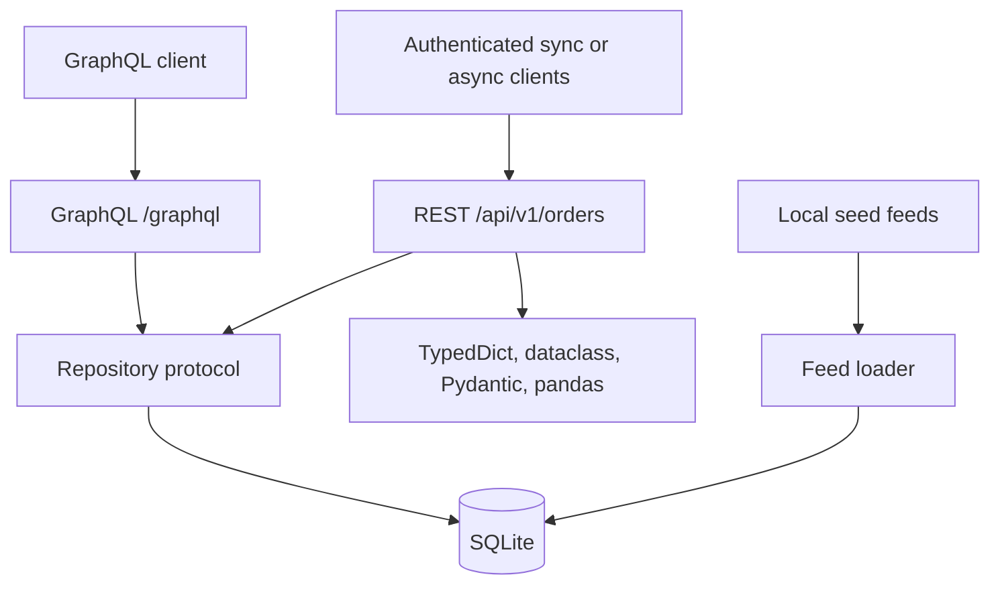

# Project Knowledge Base

## Purpose

This repository is a compact API interview lab, not one recommended production architecture.
It deliberately implements one order domain through several Python access/extraction styles so
their trade-offs can be discussed with concrete code.

## Architecture

### Dependency direction

- `domain`: dependency-free business representation.
- `data`: repository abstraction and SQLite adapter.
- `server`: REST/GraphQL transport; depends on domain/data.
- `client`: default headers, pluggable auth, sync/async HTTP, pagination, and typed methods.
- `patterns`: alternative representations of JSON extracted through the shared client.
- `feeds` and `scripts`: deterministic local simulation.
- `tests`: unit tests for boundaries and integration tests for transports.

## Request flows

### REST list

`GET /api/v1/orders?page=2&page_size=5` → validate query → calculate offset → repository
query/count → map domain objects to Pydantic response → JSON plus pagination metadata.

### GraphQL query

`POST /graphql` → parse and validate typed query → resolver → same repository → return only
fields selected by the client. GraphQL avoids over-fetching but adds resolver complexity,
authorization concerns, depth/cost limits, and N+1 risk.

### Feed ingestion

CSV row → Pydantic validation/coercion → domain object → idempotency check by ID → SQLite.
For production, use bulk writes, checkpoints, schema/dead-letter handling, metrics, and a real
transactional database or streaming platform.

### Client extraction

`SyncOrderClient` → authenticated paginated REST requests → raw JSON dictionaries → choose a
`TypedDict`, dataclass, Pydantic, or pandas representation. CSV/JSON files are only deterministic
server seed inputs and are not used by the extraction-pattern examples.

## Pattern comparison

| Tool | Best fit | Strength | Main caution |
|---|---|---|---|
| TypedDict | Statically typed raw JSON | Zero runtime overhead | No runtime validation |
| dataclass | Trusted internal domain data | Standard library, typed, lightweight | No runtime validation |
| Pydantic | API/config boundaries | Validation, parsing, schema, serialization | Extra work and dependency |
| pandas | Bounded batch exploration | Concise vectorized transformations | Memory-bound; blocks event loop |
| asyncio | Many independent I/O calls | High concurrency on one thread | Cancellation, limits, partial failure |
| REST | Resource-based public APIs | Familiar HTTP semantics/tooling | Fixed response shape/over-fetching |
| GraphQL | Varied client data needs | Typed client-selected result | N+1, query cost, caching complexity |

## Async interview notes

- `asyncio.gather()` runs awaitables concurrently and returns results in input order.
- `asyncio.as_completed()` lets results be handled in completion order.
- An async generator (`async def` + `yield`) streams multiple results to the caller.
- A semaphore limits pressure on the downstream service; it is not a rate limiter by itself.
- Production clients also need connection-pool sizing, bounded retries with jitter, deadlines,
  idempotency, observability, and an explicit partial-failure policy.
- Calling pandas or synchronous database code directly inside `async def` blocks the event loop;
  use a thread pool or an asynchronous driver for meaningful workloads.

## HTTP/API interview checklist

Discuss method semantics, status codes, validation, pagination, filtering, versioning,
authentication vs authorization, idempotency keys, conditional requests/ETags, timeouts,
rate limits, retries, structured errors, correlation IDs, metrics, tracing, and API evolution.

Current samples use:

- `200` for reads, `201` for create, `404` missing, `409` duplicate, `422` validation,
  `503` readiness failure, and `500` sanitized unexpected errors.
- Offset pagination for clarity. At scale, prefer cursor/keyset pagination to avoid growing scan
  cost and inconsistent pages during concurrent writes.
- Optional Bearer-token authentication when `API_TOKEN` is configured. Health and Prometheus
  metrics remain public for cluster probes/scraping; network policy should restrict them.

## Docker and Kubernetes notes

The Dockerfile is multi-stage and runs as a non-root user. Kubernetes demonstrates rolling
updates, two replicas, startup/readiness/liveness probes, ConfigMap and Secret configuration,
resource budgets, an HPA, a PodDisruptionBudget, and a ClusterIP service.

The app emits Prometheus request count/in-flight/latency metrics at `/metrics`, JSON logs to
stdout, and an `X-Request-ID`. The optional ServiceMonitor requires the Prometheus Operator.
Production tracing should use OpenTelemetry and a Collector rather than vendor-specific calls
inside business logic.

SQLite is deliberately a local-only compromise: replicas do not share database state and local
files are ephemeral. In a production answer, use PostgreSQL/MySQL or another managed external
store, immutable image tags, TLS/Ingress, Secrets, autoscaling, PodDisruptionBudget,
NetworkPolicy, centralized telemetry, and migrations run separately from application startup.

## Common follow-up questions

1. How would cursor pagination change the API and database index?
2. When is `gather(return_exceptions=True)` appropriate, and how is failure reported?
3. How would you prevent retry storms and duplicate POSTs?
4. How do GraphQL DataLoader and query-cost limits work?
5. Why separate Pydantic transport models from domain dataclasses?
6. How would you replace SQLite without changing routers/resolvers?
7. What makes readiness different from liveness?
8. How would you add authentication and tenant-level authorization?
9. Why are liveness, readiness, application metrics, logs, and traces different signals?

## Extension map

- Add an adapter: implement `OrderRepository` and change the dependency provider.
- Add a REST endpoint: router → Pydantic contract → repository method → integration tests.
- Add a GraphQL field: type/schema resolver → repository method → GraphQL integration test.
- Add a feed format: parser → Pydantic validation → domain conversion → loader tests.
- Add an extraction representation: implement `OrderSource` consumer → tests → comparison docs.
- Add production async DB access: introduce an async repository protocol and driver rather than
  disguising blocking SQLite calls inside async endpoint functions.
