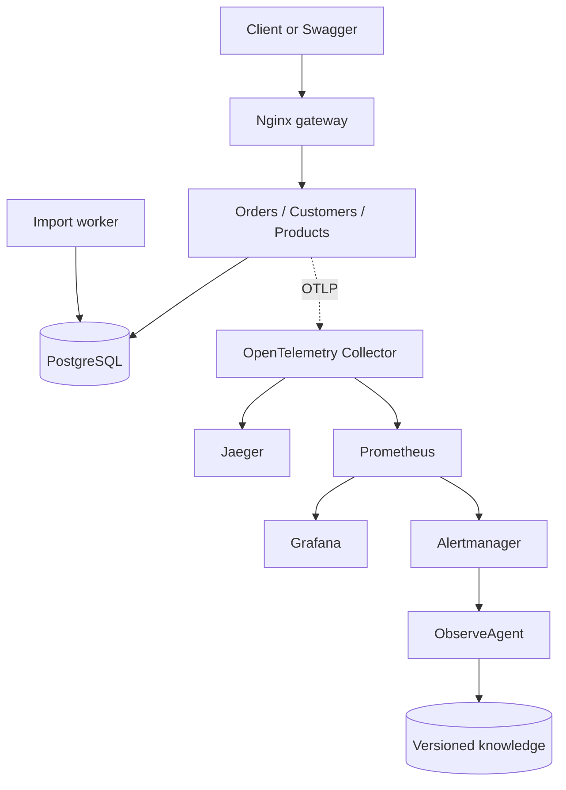
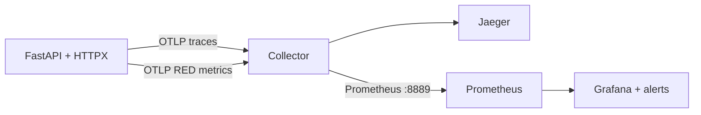

# Project walkthrough — understand every component before the interview

Use this after the README and before the system-design guide. This is a runnable teaching system:
it demonstrates decisions you can defend and names the parts a production platform would replace.

## 1. Mental model

The gateway is the public routing layer. Each service is a separate process created from one app
factory. PostgreSQL holds tenant data, idempotency records and job state. The Collector is the
common ingestion point for metrics and traces. Logs stay on stdout and carry the same trace ID.

## 2. Component map

| Component | Purpose | Start reading | Important trade-off |
|---|---|---|---|
| API gateway | One entrypoint, path routing, coarse throttling | `deploy/platform/nginx.conf` | Per-gateway/IP limits are not distributed tenant quotas |
| Service app | Contracts, validation, errors, health and orchestration | `platform/app.py` | Shared factory reduces demo duplication; real teams may own separate codebases |
| Authentication | API key, Basic and JWT become one `Principal` | `platform/auth.py` | Educational methods; production normally centralizes identity with OIDC/JWKS |
| Tenant data | Tenant reads, cursor pages and idempotent writes | `platform/store.py` | App filtering is shown; PostgreSQL RLS/roles add defense in depth |
| Async client | Pooling, deadlines, bounded concurrency/retries | `platform/client.py` | Retry only transient, safe operations within a total deadline |
| Import worker | Durable 202 job with leases and idempotent effects | `platform/worker.py` | DB queue is compact; high scale needs outbox, broker and fairness |
| Telemetry | OTLP metrics/traces and correlated safe logs | `platform/telemetry.py` | Best-effort telemetry must not become a serving dependency |
| Collector | Receive once, batch and route signals | `deploy/platform/otel.yaml` | Vendor decoupling versus another capacity/failure domain |
| Discovery | Catalog + live OpenAPI + readiness | `scripts/discover.py` | Declared discovery is not eBPF/network discovery |
| Governance | Executable contract rules in CI | `scripts/governance.py` | A catalog records metadata; CI/runtime policy enforces rules |
| Deployment | Containers, probes, resources, replicas and HPA | `deploy/platform/k8s/` | HPA creates pods; Service/LB only routes to them |
| ObserveAgent | Alert-triggered feature ETL, hybrid RAG, triage and feedback | `ObserveAgent/README.md` | Advisory and local-first; production needs durable orchestration and model evaluation |

## 3. Flow A — paginated tenant read

1. The client sends exactly one supported credential to the gateway.
2. Nginx maps `/orders/...` to orders and strips the external prefix.
3. Authentication constructs `Principal(tenant, subject, scopes)` from a verified credential.
4. Authorization requires `read`; a caller-supplied tenant header/body cannot choose the tenant.
5. Cursor signature, tenant and service are checked before it becomes a database boundary.
6. SQL filters by tenant and kind, orders by ID, and fetches `limit + 1` rows.
7. The response returns `items` and a signed `next_cursor` if another page exists.
8. Middleware records bounded route metrics and a trace-correlated JSON log.

Trade-off: keyset pagination avoids growing offsets, but this demo does not provide a consistent
snapshot while inserts occur. If required, discuss snapshot/version tokens.

## 4. Flow B — retry-safe order creation

1. Validate the JSON contract and `Idempotency-Key`.
2. Canonically hash the validated request.
3. In one transaction, reserve `(tenant, idempotency_key)` and create the order.
4. Same key + same hash returns the stored result; same key + different hash returns 409.
5. A uniqueness constraint coordinates concurrent requests across replicas.

Failure to explain: the database may commit and the response may be lost. The client retries with
the same key and learns the prior result. An in-memory map fails after restart or across replicas.
Production also defines key retention and request-replay windows.

## 5. Flow C — orders calls customers

1. Orders loads the tenant-scoped order.
2. It forwards only the supported credential to a fixed customer-service URL.
3. HTTPX injects W3C `traceparent`; the customer span joins the same trace.
4. A two-second downstream deadline bounds resource use.
5. Customer timeout becomes 504; dependency HTTP/parse failure becomes a sanitized 502.

Production uses scoped service identity instead of blindly forwarding an end-user credential.
A circuit breaker may help after measurement, but does not replace deadlines or capacity isolation.

## 6. Flow D — accepted import job

Orders persists a bounded job and returns 202. A worker atomically claims work with a lease, applies
stable per-item idempotency keys, and fences completion with a claim token. Another worker can
reclaim expired work after a crash. This is at-least-once processing with idempotent effects—not
universal exactly-once execution.

At scale, write an outbox event in the API transaction, relay it to a durable broker, fair-schedule
by tenant, expose queue age/lag, renew long leases, and provide dead-letter recovery.

## 7. Unified OpenTelemetry flow

- Counter dimensions: service, normalized route, method and status.
- Histogram dimensions: the same bounded fields; never raw paths, tenants or trace IDs.
- Metrics show aggregate rate/errors/duration; traces explain one request; logs provide event detail.
- Collector outage does not fail API requests. Queues/retries are bounded, so signals may be dropped.
- Logs remain structured stdout. In Kubernetes, a node agent would send them to a log backend.

The Collector keeps application code vendor-neutral and centralizes batching, filtering, sampling
and backend routing. It is also a shared component that needs independent scaling and monitoring.
Production often uses per-node agents plus gateway collectors.

Prometheus sends firing rule results to Alertmanager, which groups alerts and posts them to
ObserveAgent. ObserveAgent queries Prometheus rather than receiving raw time series in the webhook.
It stores only a compact reproducible incident feature snapshot. See
`ObserveAgent/docs/ARCHITECTURE.md` for the investigation and reviewed-learning flow.

## 8. Discovery, troubleshooting and governance

Discovery has three meanings: declared catalog/OpenAPI, runtime Docker/Kubernetes discovery, and
observed routes in telemetry. The lab implements all three in bounded form; it does not inspect an
arbitrary customer network.

Troubleshoot in order: reproduce and capture request ID → gateway → endpoints/readiness → RED
metrics → distributed trace → correlated logs → database/dependency → recent deployment/config.
A slow child span localizes waiting time; it does not by itself prove the root cause.

`scripts/governance.py` checks versioned paths, auth metadata, summaries and tags. Tests prove
runtime behavior. Stronger CI also diffs released OpenAPI, enforces ownership/PII metadata, scans
dependencies and blocks unapproved breaking changes.

## 9. Load balancing and scaling

Compose creates replicas and Nginx balances across them. In Kubernetes, HPA changes replica count,
Services/EndpointSlices track ready pods, and the gateway performs L7 routing. A cloud
`LoadBalancer` provides the external path. None automatically scales PostgreSQL, the Collector,
Prometheus or cluster nodes.

Budget connections as `max pods × pool per pod`, test the SLO, and preserve headroom. CPU HPA is a
lab signal; I/O services often need request concurrency, queue age or latency-aware metrics.

## 10. Interview close

Implemented: three APIs, cursor pagination, three auth examples, tenant isolation, retry-safe
creation, durable jobs, OpenAPI/catalog/governance, unified OTLP metrics and traces, correlated logs,
failure injection, dashboards, Docker routing and Kubernetes scaling examples.

Deliberate limits: shared database, local credentials, static catalog, DB-backed queue, ephemeral
observability stores, no TLS provisioning, no fleet agent, no distributed quota and no claimed
load benchmark. Explain the next production change only after confirming the requirement.

Likely follow-up: “If one tenant creates a traffic spike, which controls protect the gateway,
application pool, database, worker queue and telemetry pipeline independently?”

ObserveAgent now lives in the sibling `practice/ObserveAgent` directory with its own pyproject and tests. The current implementation uses ChromaDB, configurable OpenAI-compatible embedding/Responses adapters, LangGraph with persistent local checkpoints, approval-gated tools and one diagnostic reflection pass. Read `ObserveAgent/docs/CONFIGURATION.md` from the repository root. SQLite retains source archives and audit records.
