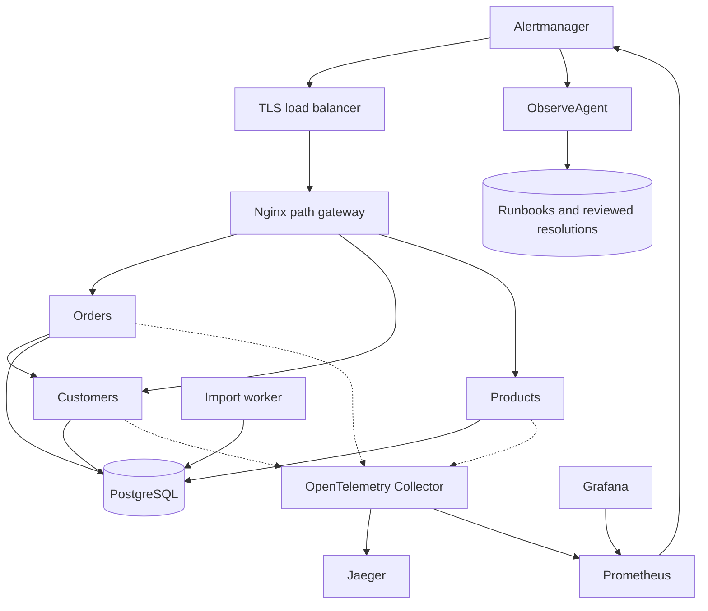

# Designing the full API platform, step by step

## Situation and task

Customers need three small commerce APIs and a developer platform that makes them usable,
secure, discoverable and diagnosable. Start with orders, customers and products. Our objective is
correct API behavior and a visible request path before adding scale. This is an interview design;
the repository implements a compact subset, not Postman's internal architecture.

## 1. Functional requirements — ask the interviewer

- Which entities and operations are needed? This lab lists/reads three entities and creates orders.
- Is data multi-tenant? Can users belong to multiple organizations? Here one credential has one tenant.
- Are consumers humans, services or agents? Here API keys, Basic and signed JWTs are demonstrated.
- Must list results remain a consistent snapshot during writes? Here keyset pagination is not a snapshot.
- Are imports long-running? Here durable bounded jobs return 202 and expose status separately.
- Does discovery mean known contracts, observed endpoints, or arbitrary customer infrastructure?
  Here trusted declared catalog + live OpenAPI + readiness are implemented; observed route metrics help.
- Must observability include logs, metrics and distributed traces? Yes, plus deliberate failure drills.
- What must governance enforce? Here version prefixes, security metadata, summaries/tags and idempotency.
- Will we deploy on one server or a cluster? Both are documented; neither is deployed by this code change.

## 2. Non-functional requirements

Negotiate availability, latency, retention, isolation and recovery targets. Example targets:
99.9% API availability, read p95 <200ms under agreed load, 2s downstream deadline, 10s metric refresh,
bounded request size and page size, no credential/payload logging, and tenant-scoped database access.
These are proposed targets, not benchmark results. Load-test before promising capacity.

Availability of serving traffic must not depend on a working Collector. Trace buffers are bounded:
telemetry can be dropped during a sustained outage. Durable imports have a different contract:
202 is returned only after the database accepts the job. Application reads/writes depend on the DB;
readiness removes unhealthy pods, liveness avoids restarting healthy processes for a DB outage.

## 3. Back-of-the-envelope estimation

Assume 1,000 active tenants × 2 requests/second average = 2,000 requests/second; 5× peak = 10,000.
At 2KB average response, peak payload egress is about 20MB/second before transport overhead.
If benchmarks show one pod sustains 500 requests/second at the target latency, 10,000/500 = 20
serving pods before failure headroom. This is a conditional estimate, not a measured pod limit.

At 2,000 requests/second × 86,400 seconds × 500-byte request event = 86.4GB/day for one event per
request. Three spans/request would be 259.2GB/day at the same average record size. At 10% uniform
trace sampling: about 25.92GB/day before indexes/replication. Count every request in metrics rather
than deriving unbiased error rates from selectively sampled traces.

99.9% time-based availability over 30 days permits 43.2 minutes of unavailability. For a
request-based SLO, budget 0.1% of eligible requests instead. Database pool capacity grows with
pod count; a shared DB can bottleneck before CPU-based HPA detects trouble.

## 4. HLD

Local Compose exposes only Nginx and localhost-bound monitoring UIs. A production deployment adds
TLS at the edge. The lab shares one physical database with explicit tenant/kind keys; true service
ownership can later separate credentials/schemas. Avoid distributed transactions until required.

## 5. Trace one ordinary read

1. Client creates default headers and selects one authentication method.
2. Request `/orders/api/v1/orders?limit=5` reaches Nginx.
3. Nginx routes to orders and strips the `/orders` public prefix.
4. Authentication verifies the credential and constructs Principal(tenant, subject, scopes).
5. Authorization requires read scope. Caller-supplied tenant selectors are not used.
6. Query validates limit and cursor. Cursor signature, service and tenant must match.
7. Store queries with tenant + kind + id > cursor, ordered by id, fetching limit+1 rows.
8. Transport maps rows to response models and returns a signed continuation cursor if needed.
9. Middleware records route-template OTel metrics and safe JSON logs. OTel creates/exports spans.
10. Client processes pages sequentially; independent service requests can overlap with bounded
    concurrency and return in completion order. Cancellation cancels pending work.

## 6. Zoom in: authentication and multi-tenancy

Authentication answers who called; authorization answers what they may do. API key and Basic
look up a server-side identity; JWT verifies claims with fixed algorithm, issuer and audience.
None is a tenant authorization policy by itself. The same verified Principal reaches the data layer.
Every lookup includes tenant, including detail, cursor and job lookup. Cross-tenant unknown IDs
return 404. POST forbids extra fields so a tenant body field cannot override identity.

For production, issue tokens from an IdP, verify asymmetric signatures through cached JWKS with
rotation, use narrowly scoped service credentials, hash stored API keys and require TLS. The
shared HMAC lab key lets all holders issue tokens and is not an enterprise trust boundary.
Use PostgreSQL RLS as defense in depth with transaction-local tenant context and audited roles.
Pools must reset context before reuse. Add per-tenant quotas, storage/retention budgets and fair
scheduling: row filtering prevents disclosure but does not prevent noisy-neighbor starvation.

## 7. Zoom in: writes, idempotency and jobs

Order creation hashes a canonical validated payload, then atomically inserts the tenant/key
record and order in one transaction. A conflicting key loads the previous response; a changed
fingerprint returns 409. Database uniqueness works across replicas and restarts. An in-process
map would fail. Define key retention and retry windows; the lab persists keys without expiry.

An import is first stored durably; a polling worker claims it by atomic compare-and-swap with an
expiring lease. Every effect uses a stable per-job/per-item key, so lease expiry and retry do not
create additional orders. A claim token fences the completion update. A 202 response means
accepted, not completed. For larger workloads add a broker/outbox, fairness, dead-letter tooling,
lease renewal and job metrics. Do not describe this as universal exactly-once execution.

## 8. Zoom in: observability, discovery and troubleshooting

Metrics answer which service/route is slow or failing. Traces show the request's dependency path.
Logs supply correlated events. OTel FastAPI and HTTPX instrumentation propagates W3C trace context
across orders → customers. RED metrics and traces use OTLP to the same Collector. It exports traces
to Jaeger and Prometheus-format metrics on one endpoint that Prometheus scrapes. Histograms retain
compatible bucket boundaries; metric attributes identify the originating service.

Never label metrics with raw URL, customer ID, trace ID, or unconstrained tenant strings. Normalize
routes and unknown paths; control status/method dimensions. Keep traces/logs access-controlled.
Default lab instrumentation does not capture request/response bodies or authentication headers.
Structured logs remain on stdout rather than OTLP; a production node agent can collect them without
making log delivery part of request success.

Declared discovery: catalog names known services; scripts/discover.py fetches their OpenAPI and
readiness using fixed trusted routes. Runtime service discovery: Docker DNS or Kubernetes Services
resolves addresses. Observed discovery: route metrics show traffic that reached instrumented apps.
Full customer fleet discovery would require collector enrollment and metadata/traffic ingestion;
this repo does not silently claim to implement eBPF packet capture or universal TLS visibility.

Troubleshooting flow: reproduce with a safe GET → note X-Request-ID → inspect service/error-rate
and latency panels → search trace → identify slow child span → correlate logs → check DB/endpoint
readiness and deployment changes. A deployment correlation is evidence to investigate, not proof
of causation. Do not replay mutating production requests without idempotency and authorization.

## 9. Zoom in: catalog and governance

Each catalog entry exposes owner, lifecycle, classification, version, spec and docs. OpenAPI serves
as the current contract. scripts/governance.py enforces a small explicit rule set and exits nonzero
on violations. Integration tests also assert security metadata and contract behavior. Future gates:
backward-compatibility diffs against released OpenAPI, ownership verification, deprecation windows,
PII classification, dependency scanning and approval policy for breaking changes.

Governance is partly preventive (CI rules) and partly runtime (auth, validation, bounded pages,
idempotency and gateway throttling). A catalog alone does not enforce access policy. The gateway's
per-IP limit is a lab overload control, not a globally consistent tenant rate limiter.

## 10. Zoom in: load balancing and scaling

L4 load balancers distribute connections; L7 gateways inspect paths/hosts and route requests.
The lab has one public gateway with three path prefixes. Service replicas are stateless with
respect to business data; PostgreSQL stores durable records and jobs. No session stickiness is
needed. Multiple Uvicorn workers would require Prometheus multiprocess configuration; use one
worker per container and scale pods in this example.

Docker DNS refresh supports replica changes. Kubernetes uses Services/EndpointSlices and readiness
for backend discovery; HPA grows replicas using CPU requests and Metrics Server. For I/O-heavy
workloads add concurrency or queue-depth metrics. Node autoscaling and DB scaling are separate.
Canary/rolling updates require compatibility across old/new API/schema versions. Drain requests,
respect termination grace, monitor error/latency changes, and roll back when health gates fail.

## 11. Result and trade-offs covered

Implemented: three paginated services, three authentication examples, tenant enforcement, atomic
idempotent creation, durable bounded import jobs, unified OTLP traces/metrics and safe correlated logs,
Swagger/OpenAPI, executable governance checks, declared discovery, monitoring dashboards/rules,
Docker gateway, and Kubernetes manifests with scaling examples.

Deliberate limitations: shared lab DB/credentials, static catalog, basic DB-backed job queue,
ephemeral telemetry storage, no public TLS provisioning, no full OAuth provider, no eBPF discovery,
no tenant quota backend and no claimed throughput benchmark. The production evolution is explicit
so you can defend each trade-off in an interview.

## 12. Agentic observability extension

The `ObserveAgent` directory implements the advisory incident loop described in the interview
design. Prometheus and Alertmanager remain deterministic detection systems. The agent activates
after incident creation, extracts reproducible metric features, retrieves approved operational
knowledge, ranks testable hypotheses, and stores the report. Reviewed resolution feedback becomes
versioned tenant/service-scoped knowledge; it does not silently retrain a model or overwrite an
approved runbook. Read `ObserveAgent/docs/ARCHITECTURE.md` and `ObserveAgent/docs/DEBUGGING.md`.

Official references:
- https://opentelemetry.io/docs/languages/python/
- https://opentelemetry-python-contrib.readthedocs.io/en/latest/instrumentation/fastapi/fastapi.html
- https://kubernetes.io/docs/concepts/services-networking/service/
- https://kubernetes.io/docs/tasks/run-application/horizontal-pod-autoscale/
- https://fastapi.tiangolo.com/advanced/behind-a-proxy/
