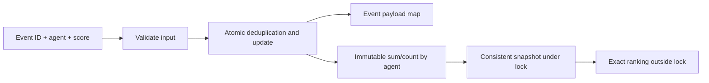
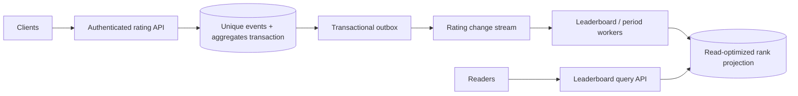

# Agent Ratings / Leaderboard — LLD and HLD

## Run

Python 3.11+, standard library only. From this directory:

```powershell
python demo.py
python -m unittest discover -s tests -v
```

`ratings.py` implements a thread-safe event-to-aggregate service. An agent is a
support agent being rated, not an AI subagent. The example is append-only: correction,
deletion and monthly windows are explicit follow-ups, not implied behavior.

## Clarifications and requirements

Ask: integer versus fractional ratings; range; whether unknown agents are accepted;
tie-breaking; minimum count; duplicate/retried ratings; period boundaries; updates;
and whether rank must reflect an exact snapshot during concurrent writes.

Implemented rules:

- `record(event_id, agent_id, score)` accepts integer scores 1..5 (booleans rejected).
- Agent creation is implicit on the first accepted rating.
- Each event ID contributes once within this service instance. Identical replay
  returns `accepted=False` and the current aggregate; different payload with the
  same ID raises `Conflict` without mutation.
- `get(agent_id)` returns an immutable aggregate or `None` for an unrated agent.
- `rank(limit=10)` returns up to 1,000 agents ordered by exact average descending,
  rating count descending, then case-sensitive agent ID ascending.
- Aggregates store sum and count. Average is an exact `Fraction`, avoiding float
  rounding in tie decisions. Formatting to decimal is a presentation concern.
- Default storage budgets: 100,000 retained event IDs and 10,000 agents. New events
  at capacity raise `CapacityExceeded`; replay remains allowed at capacity.
- Identifiers are nonempty trimmed strings, <=128 characters, without ASCII controls.
  IDs are opaque/case-sensitive; no Unicode or case normalization is performed.

Nonfunctional requirements: atomic event deduplication plus aggregation, consistent
ranking snapshots, deterministic output, bounded growth, no exposed mutable state,
and clear complexity. Data is process-local and volatile; event uniqueness is not
guaranteed across service instances or restarts. No HTTP/authentication is implemented.

## LLD alternatives and selected approach

**Store every score and recompute:** flexible for corrections, but average queries
scan historical events. **Store running average only:** compact but insufficient for
weighted updates and vulnerable to accumulated rounding. Averaging old average with
the new score is mathematically wrong unless old count is one.

**Sum + count — selected:** O(1) expected aggregation with enough information to
derive an exact average. A dictionary holds immutable `AgentRating` per agent;
a second dictionary maps event IDs to their accepted `(agent, score)` payload.
A single lock makes these two writes a coherent operation.

For ranking, take a consistent immutable aggregate snapshot under the lock, then use
`heapq.nsmallest` with key `(-average, -count, agent_id)` outside the lock. It returns
the largest averages by using a negative key. A persistent ordered index would speed
very frequent rank reads but complicate updates; add it only when the read/write
ratio justifies it.



## Invariants and concurrency

- Each accepted event ID has one immutable payload.
- Every aggregate sum/count equals its distinct accepted events.
- Stored agents have positive counts; no division-by-zero average exists.
- No validation/conflict/capacity failure changes either dictionary.

Replay checks occur before capacity checks, allowing safe retry when the store is
full. Limits are checked before mutation. Two concurrent copies of one event yield
one accepted contribution; two distinct events for one agent both contribute.
No reliance is placed on the GIL or on dictionary atomicity for this compound operation.

Ranking's linearization point is the aggregate snapshot copy. New ratings may arrive
while sorting, but cannot change the captured values. Different calls can see
different versions. A per-agent lock alone would not protect globally unique event
IDs and a consistent all-agent snapshot; lock striping needs an explicit protocol.

The current result on replay is intentionally not the original response. If client
contracts promise replaying the exact response, store that response with the event.
Event IDs are never evicted here: silently evicting old IDs allows duplicate counting.
Production retention must state its deduplication horizon or use durable uniqueness.

## Complexity

Let A be rated agents, E retained event IDs, and k requested rank size:

- Record/get: expected O(1) dictionary work, plus lock wait.
- Rank: O(A) snapshot copy and O(A log k) selection for 1 < k < A; O(A) when k=1;
  O(A log A) when k >= A. Total temporary memory is O(A + k), not just O(k).
- Stored memory: O(A + E). Exact fraction construction/comparison has arithmetic
  cost depending on integer bit length; the standard operation counts assume
  ordinary-sized counts. Python integers avoid fixed-width overflow.

Because snapshots copy all aggregates under one lock, very large leaderboards can
delay writers. This is a conscious design trade-off. The per-instance capacity cap
bounds state, not a latency SLA.

## HLD: durable rating events and leaderboard projections

Proposed architecture, not executable network infrastructure:



Example APIs: `POST /v1/ratings` with event ID, agent ID and score;
`GET /v1/agents/{id}/rating`; `GET /v1/leaderboard?limit=...&period=...`.
Derive tenant/rater identity from authentication, not client-supplied claims.

For strong aggregate consistency, a relational transaction inserts an event with
unique `(tenant, event_id)` and updates `(tenant, agent_id)` sum/count only if the
event was newly inserted. An existing event requires payload comparison. Atomic
increments or row locks prevent lost updates. Commit event and aggregate together;
then publish changes through an outbox. Do not update cache and DB separately and
assume both succeeded.

For high ingest, partition events by tenant/agent and process ordered streams. Exact
deduplication needs durable event identity or a documented horizon. Replayed and
out-of-order events cannot be blindly added to sums. Consumers can maintain processed
IDs/checkpoints atomically with aggregates, depending on the messaging/storage model.
The report should expose its freshness watermark if it is eventually consistent.

Shard aggregates by agent. A frequently rated agent is still a hot key; batch updates
or maintain sub-aggregates and combine sum/count before ranking. Averaging shard
averages is wrong without weighting by counts. If each agent's full aggregate belongs
to exactly one shard, merging each shard's top k under the same total ordering is
valid. If one agent is split across shards, combine its totals first.

A cache sorted by floating-point averages may disagree with exact fraction ties.
Specify whether approximation is acceptable. Exact ranking needs a representation
or comparison strategy that preserves the agreed ordering, especially at near-equal
averages. Avoid encoding multiple ranking dimensions into one float without proving
range and precision safety.

## Corrections, monthly reports, and further requirements

Corrections need stable rating identity plus version: subtract the previous score,
add the replacement, and change event state in one transaction. Deletion similarly
decrements count and may remove an unrated agent. Define whether historical reports
restate or remain immutable; append compensating events where auditability matters.

Monthly reporting requires event-time versus ingestion-time semantics, tenant time
zone, half-open date boundaries, late-arrival handling and retention. Store UTC event
time plus the reporting rule; do not bucket by the current process's local month.

Fairness rules (minimum rating count, Bayesian adjustments, anti-abuse filtering)
change the ranking specification and should be explicit policies. They are not
part of this simple average/count/ID order. Explain the business trade-off before
changing the algorithm.

## Reliability, security, observability

- Verify rater eligibility and agent membership; prevent duplicate abuse with more
  than an arbitrary client event ID. Apply per-tenant/rater rate and storage limits.
- Persist before acknowledging if ratings must survive crashes. Define RPO/RTO,
  backup/restore, replay and reconciliation procedures.
- Bound retry queues and consumer lag. Classify malformed events, transient failures,
  conflicts and capacity exhaustion separately; retries cannot fix a payload conflict.
- Monitor acceptance/replay/conflict rates, aggregation lag, rank latency, capacity,
  and discrepancies between event history and aggregate state. Avoid agent IDs as
  metric labels. Keep sensitive rating payloads out of routine logs.
- Rebuild projections from authoritative events and verify totals before cutover.
  Cache failure can fall back to bounded DB queries, not an unbounded full scan.

## Tests and interview walkthrough

Tests cover weighted average, exact tie ordering, replay/payload conflict, event and
agent capacity, validation, immutable snapshots, empty/top-K results, concurrent
duplicate/distinct events, and consistent concurrent reads.

Start by agreeing on ties and duplicates, implement sum/count, then test scores
`5,5,2` yielding average 4. Add event deduplication and prove simultaneous copies
contribute once. Explain why snapshot ranking happens outside the critical section.
If blocked, compare one agent's aggregate with its accepted event list; identify the
first operation where count or sum diverged before adding more abstractions.
