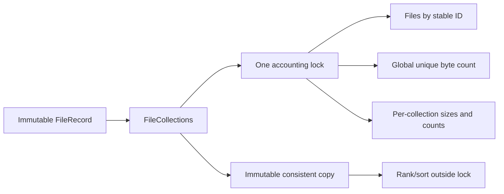
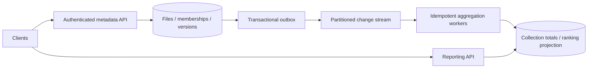

# File Collections / Top K — LLD and HLD

## Run and scope

Python 3.11+, no dependencies, from this directory:

```powershell
python demo.py
python -m unittest discover -s tests -v
```

This is a file-metadata accounting service, not a filesystem or file-upload server.
It stores stable IDs, sizes and collection memberships in memory. It never reads
file contents from disk. `file_collections/service.py` implements the use cases.

## Clarifications and requirements

Ask: identity by ID versus filename; whether a file can be in several collections;
whether total storage counts a shared file once; duplicate ingestion semantics;
updates/deletion; ties; empty collections; nested collections; concurrency and scale.

Implemented functional contract:

- A file has a stable case-sensitive ID, nonnegative integer byte size, and zero or
  more distinct collection IDs. Zero-byte files are valid and contribute to counts.
- Global size counts each file once. A file contributes its full size once to each
  distinct collection. Collection totals may therefore sum above global storage.
- `upsert(FileRecord)` fully replaces size and memberships for that ID. An equal
  upsert is a no-op. This is not an append-only event or incremental size adjustment.
- `delete(file_id)` removes all contributions and returns whether the file existed.
  Deleting an absent ID is a no-op.
- `top_k(k)` ranks by byte size descending, then collection ID ascending. k=0 is empty;
  k beyond collection count returns all. A collection disappears only when its last
  file disappears, not merely when its byte total reaches zero.
- `snapshot()` returns one immutable state with total, files, collection totals and
  a service version. Every effective mutation increments that version once.
- Optional expected global version rejects stale upserts/deletes. Version checks
  happen before no-op detection. Distinct files also share the global version.
- IDs are nonempty trimmed strings, at most 128 characters, without ASCII controls.
  Records accept at most 1,000 membership entries, including duplicates, before
  deduplication. String-as-membership-list is rejected.
- Default budgets: 100,000 files and 1,000,000 total distinct file/collection links.
  Capacity is checked before changing state. Deletes free the corresponding budget.

Nonfunctional requirements: consistent concurrent reporting, deterministic ties,
explicit units, bounded input and storage budgets, immutable detached outputs, and
testability against a recomputation oracle. This is one process, no persistence,
authentication, or independently stored empty collections. Snapshots are full exports,
not paginated public API responses; use them within the configured size budget.

## LLD: alternatives and selected model

**Recompute on every report:** keep only files and aggregate over all memberships
when reading. Simple source of truth, cheap writes, expensive frequent reports.

**Incremental aggregation — selected:** files are authoritative; dictionaries keep
collection sizes/counts plus one global byte total. Update time depends on memberships
of the changed file, not all files. Requires atomic updates across all derived state.

**Maintain an ordered ranking structure:** speeds frequent top-K reads at extra write
cost and implementation complexity. Standard Python has no built-in balanced sorted
set; a lazily invalidated heap also needs stale-entry bounds and compaction.

`FileRecord` freezes memberships into a frozenset, preventing a caller from changing
an already-stored record. `CollectionTotal` and `Snapshot` are frozen values. There
is no need for a separate class per collection or a filesystem inheritance hierarchy.



## Invariants and mutation behavior

1. Global total equals the sum of stored unique file sizes.
2. Each collection total equals the sum of member file sizes.
3. Collection count equals the number of distinct member files, including zero-byte files.
4. Size and count dictionaries have the same keys, with strictly positive counts.
5. Membership budget count equals the total number of stored unique links.

Upsert validates input/capacity, subtracts the old record's contributions if present,
stores the new record, adds its contributions, and advances the version under one
lock. Resizing and moving collections is one operation, not separate exposed steps.
Deletion similarly removes authoritative and derived state atomically.

Validation and capacity failures occur before mutation. Like typical in-memory
examples, catastrophic allocation failures are not modeled as transactional rollback;
use a durable transactional store when that guarantee is needed.

## Concurrency and complexity

One reentrant lock protects all accounting fields. Per-file locks alone would be
insufficient: two files can update one shared collection and the global total.
Snapshot copies all related state under this lock and sorts immutable copies outside
it. Top-K also ranks an immutable capture outside the lock, reflecting one point in
time. New writes do not mutate a previously returned snapshot.

The global version is simple but can reject an update to file A merely because file
B changed. For a larger service, per-file versions reduce false conflicts while
database transactions maintain shared aggregates. Without an expected version,
concurrent replacement of the same file is last-lock-winner, not a merge.

Let F be files, C collections, M total memberships, m_old/m_new memberships for the
changed file, and k requested result size:

- Upsert expected O(m_old + m_new) time, with O(m_new) record construction.
- Delete expected O(m_old) time.
- Top-K: O(C) snapshot memory/time plus O(C log k) selection when 1 < k < C;
  O(C) when k=1 and O(C log C) sorting when k >= C. k=0 returns immediately.
- Full snapshot: O(F + C) copying and O(F log F + C log C) sorting, with O(F + C)
  references/results. Immutable membership sets are shared safely, not duplicated.
- Stored memory: O(F + C + M). Python integer arithmetic grows with integer bit length;
  the operation counts assume ordinary-sized byte counts.

Long snapshot copies and high-membership writes block other operations during their
critical sections. Do not call this lock-free or horizontally scalable as implemented.

## HLD: durable file accounting and collection reports

Proposed production architecture:



Example contracts: `PUT /files/{id}` with size/memberships and expected file version;
`DELETE /files/{id}`; `GET /collections/top?limit=k`; `GET /storage/summary`.
Scope identity by tenant, and authorize source resources. Store metadata separately
from blob storage; upload byte count should be verified by trusted ingestion.

For small/moderate scale, a relational transaction can update the file, memberships,
and affected collection totals together. Lock affected rows in a deterministic order
to reduce deadlocks. Unique `(tenant, file, collection)` links prevent duplicates.
Use checked optimistic versions or row locks for same-file replacements. Add a
request deduplication key for unknown outcomes, not merely an equal-payload check.

At larger scale, write authoritative metadata plus an outbox event in one transaction.
The event includes file ID, version, and before/after membership/size information, or
consumers retrieve versioned state. Partition events by file ID for order. Consumers
must deduplicate and detect stale/out-of-order versions before applying deltas.
Summing duplicated increments corrupts reports. Periodically reconcile projections
against source data and expose an as-of watermark for eventual reports.

Partitioning by file ID balances mutations but sends changes to many collection
aggregates. Popular collections can be hot keys; partition their subtotal by bucket
and sum/merge for reads. A global top-K over collection totals cannot be obtained by
naively merging local top-K lists if each collection's total is split across shards:
first combine contributions per collection or use an algorithm with justified bounds.

Strict global total consistency introduces a serialization point. Decide whether
storage summaries require transactional accuracy or can be an eventually consistent
projection. If quotas depend on totals, enforce reservations at the write path,
not an asynchronously refreshed dashboard counter.

## Nested collections and other extensions

Nested collections are not implemented. Clarify a tree versus DAG, cycles, and whether
a shared file contributes once per ancestor or once per path. Unique-descendant
semantics need deduplication/reference counts and change propagation; summing child
totals is wrong when child memberships overlap. Add cycle detection and tests before
choosing a recursive aggregation strategy.

Other extensions: count-based ranking (already tracked, add explicit sort mode),
per-file versions, tenant namespaces, batched atomic updates, paginated exports and
durable repositories. File rename should preserve stable ID; names are display data.

## Reliability, security, capacity, and tests

Apply per-tenant file/membership quotas and request limits; do not trust client sizes
for billing. Monitor processing lag, projection drift, version conflicts, hot
collections, transaction latency and report freshness. Use bounded worker retries,
dead-letter handling with replay, backups and restore tests. Deleting blobs and
metadata spans systems: use explicit lifecycle state and reconciliation rather than
assuming both operations commit together.

Tests cover duplicate memberships, ungrouped and zero-byte files, resizing/moving,
deletion, deterministic ranking, k boundaries, immutable inputs/results, versions,
storage limits and concurrent compare-and-swap. A seeded 500-operation test recomputes
all totals from authoritative files after every mutation. Concurrent readers verify
the same invariant while writers add and delete files.

In the interview, start with one file in two collections and show why global total
differs from summed collection totals. Then implement the delta update and prove it
with a resize-and-move test. If blocked, recompute from files to locate the incorrect
derived counter before optimizing.
