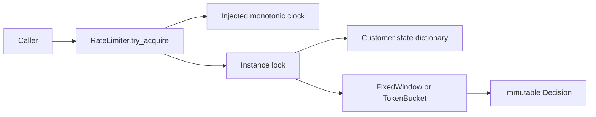
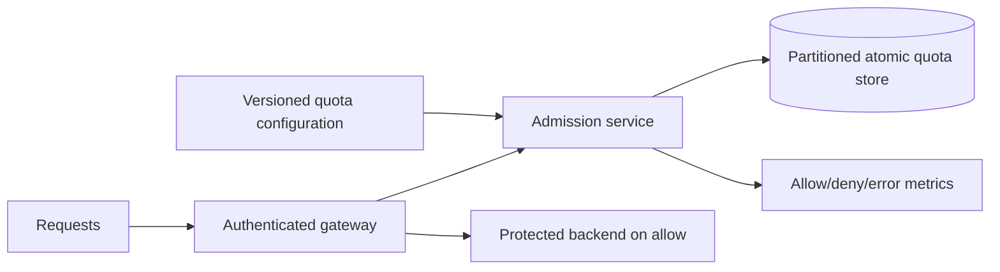

# Rate Limiter — LLD and HLD

## Run

Python 3.11+, standard library only, from this directory:

```powershell
python demo.py
python -m unittest discover -v
```

The parent `run_all.py` also runs this suite. `rate_limiter.py` contains the engine,
policies and immutable admission result. Tests use an injected fake clock and real
threads; they do not wait for wall-clock windows to expire.

## Problem, clarifications, and requirements

Implement `try_acquire(customer_key, cost=1)` that atomically decides whether a
customer can consume quota. It returns allowed/denied, remaining capacity, and the
earliest retry delay assuming no competing requests. It does not execute requests,
block until admission, or schedule retries.

Clarify: fixed window versus any rolling interval; key scope (tenant/customer/IP/
resource); whether denial consumes quota; weighted request costs; burst allowance;
unused credit cap/expiry; distributed scope; fail-open versus fail-closed; customer
cardinality and idle cleanup. Do not assume token buckets enforce an exact rolling
window limit: they enforce a sustained refill rate plus bounded burst allowance.

Implemented functional requirements:

- Independent per-key state within one limiter instance.
- Fixed-window quota aligned to multiples of window length on the supplied clock.
- Token bucket with continuous replenishment, bounded capacity, and fractional costs.
- Atomic refill/reset, check, and consume, including concurrent requests for one key.
- Finite validated configuration; fixed limits 1..1e12; other positive policy values
  1e-9..1e12. Fixed costs are integer-valued and no larger than quota; token costs
  cannot exceed capacity. These are explicit numerical guardrails.
- Injected monotonic finite time between zero and 1e12 seconds; backward time raises an error.
- Bounded tracked-customer count and cleanup that cannot manufacture extra quota.

Nonfunctional requirements: deterministic boundary behavior, O(1) normal decisions,
bounded cardinality, clear extension points, no network work under synchronization,
and readable/testable code. State is not durable. Lock acquisition has no deadline
or fairness guarantee. Clock/policy callbacks are trusted and must be fast and pure
except for the documented state update. No measured throughput target is claimed.

## LLD: alternatives and selection

**Fixed window:** counter/balance per key, simple O(1) state. Up to twice the limit
can be admitted around a boundary across two adjacent windows; it does not satisfy
an exact any-N-seconds requirement.

**Sliding timestamp log:** exact rolling-window semantics by expiring timestamps;
memory grows with accepted requests in the window. Expiry is amortized but one
request may remove many entries. Not implemented because this example explicitly
selects fixed windows and token buckets.

**Token bucket:** bounded stored credits support bursts while enforcing average
refill. Capacity is the burst ceiling. This is not a monthly credit ledger or
unbounded carryover; distinct credit-expiry rules need another policy.

The `Policy` protocol exposes cost validation, new state, acquisition, and the
condition for safely forgetting state. `RateLimiter` owns keys, the clock, memory
budget and synchronization. `FixedWindow` and `TokenBucket` are immutable policy
configurations; their customer states are private mutable values. One policy is
used per instance. Per-customer policy selection is a documented extension, not
an unimplemented claim.



## Invariants and numerical semantics

- A key has exactly one live state while protected by the instance lock.
- Fixed balance is reset once on entry into a later window; integer costs are
  subtracted exactly using Python integers.
- Token balance is replenished up to capacity and consumed only if sufficient.
- Rejected acquisitions do not subtract cost, but update time/idle bookkeeping.
- Cleanup and admission use the same lock and policy, so they cannot operate on
  two independent states for one key.

Internal token arithmetic uses exact fractions constructed from the decimal string
representation of supplied costs, rates, and clock readings. This prevents tiny costs
from disappearing against large balances and makes decimal refill boundaries exact
for the supplied values. Fixed-window indexing uses the same conversion to avoid
binary rounding placing 0.3 seconds in the preceding 0.1-second window. Public
remaining/retry values are approximate floats for display and do not drive admission.
The clock itself still has its source precision; this does not recover lost precision
in a caller's arithmetic. Fraction operations have integer-bit-length costs. Scaled
integer ticks/tokens with explicit rounding are an alternative for a high-throughput
production contract. Retry delay is advisory under contention.

## Concurrency and memory cleanup

One lock protects time validation, dictionary lookup/creation, refill/reset, quota
consumption and deletion. The admission decision is linearized within this critical
section. Different keys contend on the same lock: deliberate simplicity, not a
claim of unconstrained parallel scaling.

Deleting a depleted idle bucket early would recreate it full on the next request.
Therefore fixed state is forgettable only after its window passes, and token state
only once it would refill to capacity. The key must also exceed the supplied idle
threshold. Cleanup scans under the same lock, eliminating an eviction/reference
race. At `max_customers`, new keys fail with `CustomerCapacityExceeded`; existing
keys retain their limits. Cleanup is explicit, not an implicit O(K) scan on each
request. Limit identity-cardinality attacks at the application boundary as well.

For greater local parallelism, partition keys into a fixed number of limiter shards
with separate locks. Every request and cleanup for a key must choose the same shard;
each shard has a memory budget. Do not delete arbitrary per-key mutexes while another
thread may retain their references. A process-local lock cannot enforce a fleet quota.

## Complexity

Let K be tracked customers. Admission is expected O(1) dictionary work and O(1)
policy work, plus synchronization wait. Memory is O(K). Cleanup is O(K) time and
O(K) temporary expired-key storage in the worst case. Customer count is O(1).
The bound assumes identifier hashing/length is bounded (keys max 512 characters).
No unbounded queues or per-request timestamp logs are stored by these policies.

## HLD: distributed rate limiting

Proposed architecture, not implemented here:



Example contract: `POST /v1/admissions` with tenant, subject, resource and cost;
response includes allowed/remaining/retry delay. Caller identity must be authenticated
and tenant/subject canonicalized. The gateway can return HTTP 429 on a genuine quota
denial; an unavailable limiter is a distinct infrastructure failure.

Use a server-side atomic operation to read time/state, refill, compare and consume.
For Redis, an atomic script/function can implement one bucket; keep TTL compatible
with the policy's safe-forgetting condition. Read/check/write across separate client
calls is racy. Store-side time avoids differences between gateway monotonic epochs.
If multiple quota keys must be consumed atomically (user and tenant), explicitly
address co-location/transactions or a reservation protocol; sequential independent
checks can consume one quota while the other denies.

Partition by canonical quota key. A single hot global key remains serialized;
consider capacity leases to regional workers, accepting documented overshoot or
unused reserved capacity. Locally limiting each of N replicas independently multiplies
the effective limit unless budgets are coordinated. Strict global quotas trade off
latency and availability during partitions.

Define retry semantics: retrying an admission after an unknown network outcome can
consume twice. Deduplicate with a request ID and bounded TTL if necessary, with
the deduplication and admission mutation in the same atomic unit. Expiring a replay
record changes the guarantee and must be explicit.

Configuration changes need versioning and a policy for existing balances: reset,
clamp, or translate them. A smaller capacity cannot leave an oversized balance.
Do not silently overwrite policy objects while active state uses another meaning.

## Reliability, security, and operations

- Decide fail-open versus fail-closed per protected endpoint and business risk.
- Bound remote calls, connection pools and queues; avoid retry storms with jitter
  and an overall deadline. Backend authorization still applies after admission.
- Track allowed, denied, infrastructure errors, decision latency, hot keys, state
  count and cleanup duration. Avoid raw customer IDs as metric labels.
- Replication/failover may lose recent quota updates unless guarantees prevent it;
  document possible temporary excess admission. Restarts reset this local example.
- Load-test hot-key and many-key workloads separately, including cleanup contention.

## Tests and interview extensions

Tests cover independent keys, exact window reset, rejection, token refill/cap,
fractional costs, concurrent check-and-consume, cleanup racing requests, capacity,
invalid configurations/costs, and invalid/backward time. Thirty-two simultaneous
requests against a fixed capacity must produce exactly that many admissions at a
frozen clock.

Extensions to rehearse: sliding log policy, policy registry per customer, fixed-period
credit carryover with cap and expiry, lock striping, request deduplication, and
distributed key consistency. State how each changes invariants and add regression
tests. If blocked, freeze time and reduce the failure to two calls on one key.
