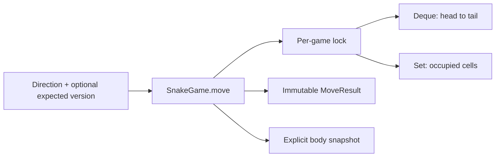
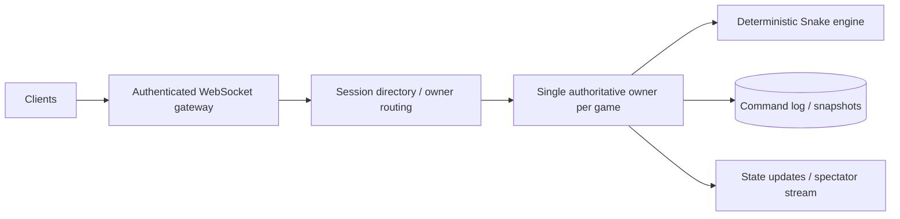

# Snake Game — LLD and HLD

> **Looking for Snake and Ladder?** See [SNAKE_LADDER.md](SNAKE_LADDER.md),
> [snake_ladder.py](snake_ladder.py), and [its tests](tests/test_snake_ladder.py).
> Run `python demo_ladder.py`. That is a separate turn-based board game;
> the moving-snake implementation documented below is preserved.

## Run

Python 3.11+, standard library only. From this directory:

```powershell
python demo.py
python -m unittest discover -s tests -v
```

`snake.py` is a deterministic thread-safe game engine. There is no UI, game loop,
timer, network server, or renderer. `move` advances one command, and `snapshot`
returns a detached immutable body for rendering or tests.

## Clarifications and functional requirements

Ask: finite/infinite board; wall collision or wraparound; initial body and direction;
food-based versus periodic growth; whether reversal is legal; moves after game-over;
automatic ticks versus explicit calls; and whether simultaneous commands need order.

Implemented rules:

- Board width >= 3, height >= 1, integer coordinates.
- Initial head-first body is `(0,2), (0,1), (0,0)`, facing right, length three.
- A move goes one cell up/down/left/right. Immediate reversal is invalid and leaves
  state unchanged. Direction input must be the explicit enum.
- Length grows every fifth successful move by default; `grow_every` is configurable.
- Boundary mode is either terminal wall collision or wrapping in both dimensions.
- Self-collision ends the game. The tail cell is safe only when it vacates this move.
- Terminal collision leaves body and successful-move count unchanged, sets game-over,
  records collision reason and increments the state version once.
- Calls after game-over are no-ops, unless supplied with an obsolete expected version.
- Invalid input and stale commands do not change the body, count, or version.
- Optional optimistic `expected_version` rejects commands based on an old snapshot.

Nonfunctional requirements: expected O(1) move cost, no full board allocation,
consistent body/occupancy state, deterministic tests, encapsulated mutable state,
and independent games that do not contend on one global lock. State is process-local
and volatile. Lock fairness and real-time frame deadlines are not guaranteed.

## LLD: approaches and data structures

**Body list alone:** easy to understand, but O(S) collision scan and potentially O(S)
head insertion for snake length S. Fine as a baseline, not chosen for efficient moves.

**Board matrix:** constant-time occupancy but O(width × height) allocation, often
wasteful for sparse/large boards. Still needs ordered body tracking for tail removal.

**Deque plus hash set — selected:** deque stores head-to-tail order, and set provides
expected constant-time occupancy checks. Both contain immutable `Cell` values.
Enums make directions and boundaries explicit; immutable `MoveResult` separates a
small move response from an O(S) rendering snapshot.



## Invariants and move algorithm

Invariants: the occupancy set equals the cells in the deque; cells are unique;
the head is deque position zero; body cells are within bounds after normalization;
and a terminal game never resumes.

For each move, while holding the game lock:

1. Verify expected version and terminal status.
2. Reject reversal before changing state.
3. Compute the proposed head and apply boundary semantics.
4. Determine whether this successful move would grow the snake.
5. Check occupancy, exempting the old tail only if it will vacate.
6. Remove the tail from deque and set when not growing.
7. Add the new head to both, update direction, count, and version.

The collision checks occur before body mutation. Removing the tail first without
thinking about failure semantics could damage the body on a rejected move. The
explicit exemption handles that edge case without rollback machinery.

A full 3×1 wrapping board is a useful test: moving right into the old tail is legal
without growth and a self-collision on a growth turn. No random food generator is
needed for the periodic-growth contract.

## Concurrency and complexity

A per-game lock makes checking/mutating all fields one atomic operation. Two commands
with expected version zero have exactly one successful winner; the other gets
`VersionConflict`. Without version preconditions, both commands are applied in lock
acquisition order, which is not necessarily arrival or user-intent order.

State versions prevent lost/stale commands but are not replay deduplication. A retry
after success with the original version conflicts. A distributed command protocol
needs command IDs and replay responses if transparent retries are required.

Move cost is expected O(1), memory O(S), and snapshot cost is O(S) time/output memory.
Returning the entire body on every move would make the public operation O(S), so
the code deliberately returns a small `MoveResult`. Hash-set worst cases are not
constant time. Integers are arbitrary precision; this model treats board coordinates
as ordinary machine-sized values when describing complexity.

## HLD: authoritative multiplayer/session platform

HLD is an extension for a hosted game, not necessary for a local Snake interview:



Example APIs: create a game with dimensions/rules, send a command containing game ID,
command ID, sequence/expected version and direction, and read a snapshot/version.
The server validates player ownership and rate limits commands. Clients can predict
for responsiveness but reconcile to the authoritative version.

Assign each game to one owner/actor and serialize its command stream. Partition by
game ID for horizontal scaling across many independent games. Adding servers does
not parallelize one game's state transitions safely. A session directory maps game
IDs to owners; ownership leases need fencing epochs so an old owner cannot keep
writing after failover. Sticky routing alone is not ownership coordination.

For persistence, record accepted commands and periodically snapshot body, direction,
growth rule, boundary rule, count, version and any random seed/state used by future
food rules. Replay must use the same engine/rules version. Decide whether commands
are acknowledged before or after durable logging: that determines loss on crashes.
If a future food generator is random, inject its source and record enough to replay.

Control slow consumers with bounded outgoing buffers. Coalesce intermediate state
updates and provide resynchronization snapshots rather than accumulating unlimited
frames. Spectators can use a separate fanout layer; control latency should not depend
on the slowest spectator. A shared replay log is not itself a low-latency game loop.

## Reliability, capacity, security

- Negotiate tick/input rate, maximum board/snake size, concurrent games, and update
  payload size. For G games averaging S cells, engine memory is O(GS); broadcasting
  full bodies every tick costs O(GS × tick rate), motivating deltas and snapshots.
- Set idle-session expiry and disconnect/reconnect policy. Preserve replay data for
  the promised recovery period; this in-memory engine does not do so itself.
- Authenticate player/session ownership, validate sequence numbers, reject excessive
  input, and avoid trusting client-reported positions or scores.
- Monitor command latency, dropped/stale inputs, owner failover, queue depths, frame
  lag and resynchronizations. Do not put every game ID into metric labels.
- Regional placement reduces input latency. Cross-region active writers for one game
  need coordination; a home-region owner is a simpler initial design.

## Tests and interview follow-ups

Tests cover initial state, growth boundary, wall collision, post-game no-op, tail
vacating versus growth, body collision, invalid/reversal input, configuration,
stale commands, one optimistic-version winner, and concurrent moves preserving state.

Extensions: food on unoccupied cells, configurable growth policy, obstacles, pause,
replay, and multiple snakes. Food on an almost-full board needs bounded selection
rather than an unbounded random retry loop. Multiple snakes introduce simultaneous
move semantics; a lock alone does not decide head-on collisions or turn priority.

In a 60-minute interview, first agree on rules, compare list/matrix/deque-set, state
the invariant, implement a move, and demonstrate the tail-cell test. Explain the
HLD only when asked. If blocked, print a four-cell body and trace one move by hand.
