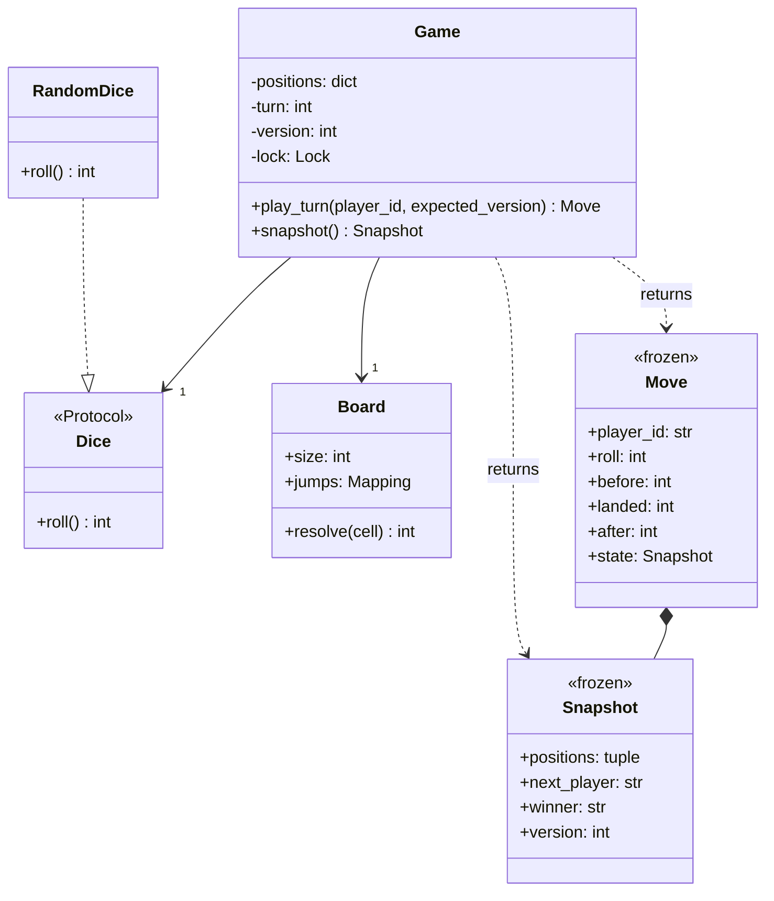

# Snake and Ladder — Low-Level Design
45-minute interview guide: clarify → model → implement → test → discuss extensions.
[Implementation and tests — practice/LLD/snake-game](https://github.com/sangeetjena/practice/tree/master/LLD/snake-game)
The existing moving-snake exercise is preserved. Snake and Ladder uses snake_ladder.py, demo_ladder.py and tests/test_snake_ladder.py. Hosted storage/HTTP features below are extension designs, not implemented adapters.

## 1. Module/component overview
**Opening answer:** “I will build a small game engine with a validated board, ordered players and an injectable die. Game owns all mutable state. A turn validates the caller, rolls, resolves jumps, checks the winner and advances the version atomically.”
### Clarify the rules first
- Are wins exact? **Yes; overshoot stays in place but consumes the turn.**
- Does six grant another turn? **No.** Does the game need six to enter? **No; start at zero.**
- Can jumps chain? **Yes; reject cycles at setup.** Can a ladder finish the game? **Yes.**
- How many players? **2–6 unique nonempty IDs**, fixed round-robin order. Shared cells are allowed. First winner ends the game.
- Is this an in-memory exercise or a hosted service? **Implement memory first; discuss database persistence and APIs afterward.**
### Small file structure
```text
LLD/snake-game/
  snake_ladder.py              # values, errors, Dice, Board, Game
  demo_ladder.py               # console output / logging
  tests/test_snake_ladder.py   # deterministic behavior tests
  SNAKE_LADDER.md              # practice guide
  snake.py / demo.py           # existing different game; retained
```
One small engine module is deliberate: separate responsibilities do not require one file per class. If it grows, split models.py, board.py, dice.py, game.py and errors.py without changing the public API.
### The 45-minute allocation
- **0–5 min:** clarify rules and state the invariants. Write one chained-jump example.
- **5–10 min:** sketch Board, Game, Dice and Snapshot; decide who owns mutable positions.
- **10–30 min:** implement values/errors, board validation, dice injection and atomic play_turn. Keep narration focused on ownership and invariants.
- **30–40 min:** write four representative tests: chain, overshoot/win, rejected command and concurrent stale version. Run them and fix failures.
- **40–45 min:** explain complexity, restart/retry behavior and one requirement change. The full checked-in regression suite is preparation material; do not spend interview time reproducing every test/docstring.

## 2. Data models & storage
### Actual in-memory models
- **Board:** size plus copied, read-only jump map; precomputed source → final destination. No 2D matrix or mutable Cell objects are required.
- **Game:** tuple of player IDs; dict of player ID → position; current-player index; winner; version; per-game lock; Board and Dice references.
- **Snapshot:** frozen dataclass containing tuple[(player_id, position)], next_player, winner and version. Returned values cannot mutate the engine.
- **Move:** frozen result containing player_id, roll, before, landed, after and the resulting Snapshot. “landed” is the raw die target, even when it exceeds the board.
```python
@dataclass(frozen=True)
class Snapshot:
    positions: tuple[tuple[str, int], ...]
    next_player: str | None
    winner: str | None
    version: int

# Logical relationship, not a SQL table:
# Game owns 2..6 positions and references 1 Board + 1 Dice.
# Move contains the immutable Snapshot after its turn.
```
! frozen=True alone is shallow. Board copies caller input and wraps maps in MappingProxyType; Snapshot uses nested tuples and immutable scalar values.
**Why dataclasses:** concise constructors, equality and readable values with no external dependency. HTTP adapters can later use Pydantic for untrusted JSON validation; that does not require replacing the domain values. Player IDs are strings here: add a Player value object when names/profiles add real behavior or data.
### Persistence extension and ER mapping
```text
board_version (board_id, revision) 1 ─── * game_session
game_session (game_id)            1 ─── 2..6 game_member
game_session (game_id)            1 ─── * turn_receipt
```
The HLD contains the complete proposed PostgreSQL table definitions. Board maps to an immutable board version; Game maps to one JSON snapshot row with a numeric version; roster membership is indexed separately; command receipts preserve committed retry results.
```sql
-- Extension only: all service replicas lock the same game row.
BEGIN;
SELECT snapshot, version FROM game_session
WHERE game_id = :game_id FOR UPDATE;
-- Authorize; replay matching receipt if present.
-- Otherwise validate expected version and current player.
-- Compute and save new snapshot + receipt in this transaction.
COMMIT;
```
Primary keys: game_id; (board_id, revision); (game_id, player_id); (game_id, command_id). UNIQUE(game_id, version) on successful receipts prevents two results for one revision; index (player_id, game_id) supports “my games.” Typed application validation enforces snapshot invariants.
**Memory limitation:** restarting Python loses the games. A future repository restores the complete snapshot and board version; it must not restart everyone at zero or reroll historical moves. That adapter requires a validated restore factory or a pure transition function, neither included in this compact iteration.

## 3. API contracts & specifications
### Implemented Python API
```python
Board(size: int = 100, jumps: Mapping[int, int] = {})
Board.resolve(cell: int) -> int

Game(board: Board, players: Sequence[str], dice: Dice | None = None)
Game.snapshot() -> Snapshot
Game.play_turn(
    player_id: str,
    expected_version: int | None = None,
) -> Move
```
The Board signature above is descriptive: implementation uses default_factory=dict, not a shared mutable default. Inputs are typed Python values; an external adapter must validate JSON shape and impose request-size limits.
```python
game = Game(Board(20, {2: 8, 8: 5}), ["alice", "bob"], FixedDice(2))
move = game.play_turn("alice", expected_version=0)
assert (move.before, move.landed, move.after) == (0, 2, 5)
assert move.state.next_player == "bob"
assert move.state.version == 1
```
FixedDice is the test fake supplied in tests/test_snake_ladder.py. A normal application omits it to use RandomDice.
### Error contract
- **GameError:** catch-all domain base class.
- **InvalidInput:** invalid size/jump/cycle, roster, cell, version or die result. Subclasses ValueError as well as GameError.
- **Conflict:** wrong/unknown player for the current turn, stale expected_version or a finished game. Rejections do not consume a die roll.
- A dice-source exception propagates; game state remains unchanged. Do not silently turn a failed die into a successful move.
Version is optional for simple local calls. A hosted adapter must require it. If callers omit versions, turn order is still enforced, but a sufficiently delayed request could execute on a later turn; the lock alone cannot identify stale user intent.
### Proposed HTTP adapter
```http
POST /v1/games/{game_id}/turns
Authorization: Bearer <token>
Idempotency-Key: <command-uuid>

{"expected_version":0}

200 OK
{"player_id":"alice","roll":2,"before":0,
 "landed":2,"after":5,"version":1,
 "next_player":"bob","winner":null}

GET /v1/games/{game_id}
200 OK
{"version":1,"positions":[["alice",5],["bob",0]],
 "next_player":"bob","winner":null}
```
Map InvalidInput → **400**, Conflict → **409**; adapter errors include **401/403/404/429/503**. Authenticate before calling the engine. The request has no die value. HLD creation and durable receipt handling are outside this implementation.

## 4. Class & object design

Figure 1. Classes match the code; Board and Dice are injected dependencies, and results are immutable values.
### Responsibility boundaries and SOLID
- **Single responsibility:** Board validates/resolves geometry; Game controls turn state; Dice supplies randomness; demo owns logs/presentation.
- **Dependency inversion:** Game calls the Dice protocol, so RandomDice and FixedDice are interchangeable without a branch in game logic.
- **Interface segregation:** Dice exposes only roll(). No oversized “game framework” interface.
- **Substitution:** every valid die must return an integer from 1 to 6. Game validates this at the boundary before committing state.
- **Extensibility:** a new dice implementation changes no Game code. Different movement rules require a small explicit change first; introduce a rule strategy only when multiple policies must coexist.
There is no mutable Player instance shared with callers. Position ownership stays inside Game. Board may be shared across games because it is immutable; mutable test dice should normally be distinct per game.

## 5. Design patterns — only where useful
### Strategy through a Protocol
```python
class Dice(Protocol):
    def roll(self) -> int: ...

class RandomDice:
    def roll(self) -> int:
        return randint(1, 6)

# Game accepts either RandomDice or a deterministic test fake.
# Explicit inheritance from Dice is unnecessary in Python.
```
**Protocol vs ABC:** Protocol provides structural typing and easy test fakes; an abstract base class is useful if implementations need shared behavior or enforced abstract-method instantiation rules. Neither makes execution thread-safe. Here Protocol is sufficient.
**Value objects:** Board, Move and Snapshot hold validated configuration/results. Their immutability simplifies sharing and observation.
**Patterns deliberately omitted:** no singleton manager, observer hierarchy, factory hierarchy or per-game worker thread. Add a repository interface when a second storage implementation exists; add notifications in an adapter after the state commit. Synchronous observer callbacks inside the lock could raise or block halfway through a turn.

## 6. Detailed logic, algorithms & verification
### Board setup: validate once, reuse often
Copy the jump mapping. For each unresolved source, walk its chain with a local visited set. A repeated cell in that walk is a cycle. Stop at a normal cell or a previously memoized destination; memoize the terminal destination for every visited source.
Example: {2:8, 8:5, 6:1} becomes destinations {2:5, 8:5, 6:1}. Both snakes and ladders are directed jumps. A self-jump and 2→8→2 are invalid. A dictionary cannot retain duplicate source definitions: if parsing a list/CLI, reject duplicates before converting it to a dict.
**Complexity:** setup O(J) time/space because resolved sources are not traversed again. resolve is O(1). No recursion limit. Precomputation returns the final cell rather than a full animation path; add a trace method if the UI requires every hop.
### Atomic turn workflow
```mermaid
sequenceDiagram
    participant Caller
    participant Game
    participant Dice
    participant Board
    Caller->>Game: play_turn(player_id, expected_version)
    activate Game
    Note over Game: Acquire per-game lock
    Game->>Game: Validate version, unfinished state, current player
    Game->>Dice: roll()
    Dice-->>Game: 1..6
    Game->>Game: Validate roll; compute landing
    alt Within board
        Game->>Board: resolve(landing)
        Board-->>Game: final destination
    else Overshoot
        Game->>Game: Keep old position
    end
    Game->>Game: Commit position, winner/next player, version
    Note over Game: Copy immutable snapshot; release lock
    Game-->>Caller: Move
    deactivate Game
```
Figure 2. Validation and updates share one critical section; reads use the same lock.
```python
with self._lock:
    # 1. Validate expected_version, unfinished state and player.
    roll = self._dice.roll()
    # 2. Validate roll before mutating game state.
    landed = before + roll
    after = before if landed > size else board.resolve(landed)
    # 3. Commit position; set winner OR advance round-robin index.
    # 4. Increment version once; return Move with a value snapshot.
```
An overshoot is a **successful turn**, so it increments version. A rejected command is not. The final cell is checked after jump resolution. After winning, next_player is None and further turns raise Conflict.
State mutation/lookup is O(1); returning a snapshot is O(P), where P ≤ 6. Board storage is O(J); game state is O(P). Avoid claiming the entire operation is O(1) for an unbounded player count.
### Concurrency and failure handling
- **Writer + reader:** snapshot acquires the same lock, then copies state. A reader sees the state before or after a turn, never half a turn. No reliance on the GIL for a multi-step invariant.
- **Two writes at version 0:** the first commits version 1; the second observes a stale version and fails before rolling. A barrier-based test starts both contenders together.
- **Multiple games:** each has its own lock; independent games do not serialize behind a global lock. CPU throughput is still subject to Python/runtime limits.
- **Critical-section discipline:** injected dice must be fast/trusted and must not re-enter Game. Keep network I/O, logging handlers and user callbacks outside the lock. The demo logs the returned immutable Move.
- **Restart and multiple processes:** the local lock does not coordinate application replicas or survive restart. Use the HLD transaction/receipt design, not a second independent Game object as another authority.
! Version checks reject stale work; idempotency receipts replay completed work. This implementation has version checks, not durable retry deduplication.
### Test cases and corner cases
The checked-in suite covers initial state/copied roster; direct snakes and chained jumps; overshoot; six without bonus; shared cells; exact/laddder win; post-win rejection; wrong/unknown player; stale version without consuming dice; invalid rolls and failing dice; invalid boards/cycles; immutable board/snapshots; invalid roster/version/cells; long chains; concurrent same-version requests; and independent games.
For interview coding, select four tests that demonstrate the main rules and atomicity. Then enumerate the remaining cases aloud. No sleeps are used to “prove” concurrency.
### Windows / PyCharm terminal: setup and run
Python 3.10+ is sufficient. This exercise has no runtime or test dependencies; unittest is built in. Run from the repository root:
```powershell
cd LLD/snake-game
uv run --no-project --python 3.12 python demo_ladder.py
uv run --no-project --python 3.12 python -m unittest discover -s tests -v
```
An installed Python also works with python demo_ladder.py and python -m unittest discover -s tests -v. Avoid adding a nested dependency project merely to run standard-library code. The existing LLD/run_all.py already discovers both games' tests in this directory.
### Handling changed requirements
- **Extra turn on six:** change only the post-move turn policy; winning must still terminate before granting an extra turn. Add a regression test.
- **Multiple dice:** generalize the accepted roll range and inject a corresponding dice strategy together. Replacing the die alone is insufficient because the current contract permits only 1–6.
- **Bounce on overshoot:** introduce a movement policy if both modes are required; explicitly define repeated bounces for small boards.
- **Rank every player:** replace the single terminal winner with finish order and skip finished players. This changes the state model and termination condition.
- **Board editing:** publish a new immutable Board for future games. Do not mutate a running game's jump configuration or precomputed destinations.
- **Persistence/API:** extract a validated state restore/transition seam and implement repository transactions, membership authorization and receipts. Keep that work outside the 45-minute core.

## References
[Workat.tech — machine-coding rules](https://workat.tech/machine-coding/practice/snake-and-ladder-problem-zgtac9lxwntg/)
[AlgoMonster — simple object boundaries](https://algo.monster/courses/lld/lld_snake_and_ladder)
[Codefarm — dependency injection and rule variations](https://codefarm.in/guides/lld/06-lld-interview-problems/snake-and-ladder)
[Ashish Pratap Singh — class/UML reference](https://github.com/ashishps1/awesome-low-level-design/blob/main/problems/snake-and-ladder.md)
The diagrams and code here intentionally use fewer types than some references, preserving the rule and concurrency guarantees needed for this interview scope.
