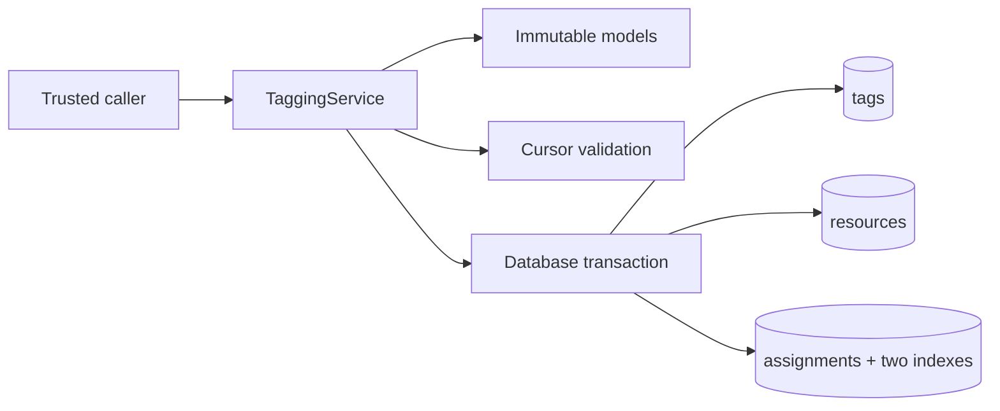
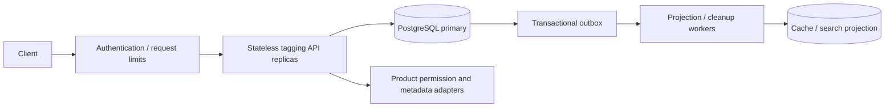

# Tagging service: Principal Engineer LLD practice

A runnable Python 3.11+ service library for tenant-scoped tagging across Jira issues,
Confluence pages, and other resource types. It uses only the standard library.
The implementation demonstrates explicit contracts, transactional concurrency,
durable storage, bounded work, keyset pagination, and tests that exercise races.

This is an interview reference implementation, not a claim that every production
requirement is implemented. It deliberately keeps the application service readable.
Distributed deployment, HTTP transport, identity verification, product permissions,
telemetry, automated migrations, and asynchronous bulk jobs are design extensions
documented below. They are not hidden behind nonfunctional placeholder classes.

## 1. Run it

### Local follow-up requirements

The implementation remains standard-library Python + SQLite: no DynamoDB account,
containers, Redis, queue, or HTTP server is needed. New runnable access patterns:

```python
service.search_tags("rel", limit=20)  # normalized literal prefix, not wildcard search
service.find_resources([tag_a, tag_b], match="all")  # intersection
service.find_resources([tag_a, tag_b], match="any", product="jira", resource_type="issue")
```

Here `tag_a` and `tag_b` are tag ID strings. Both methods accept `cursor` and return
`Page` values. Multi-tag search accepts 1-20 input entries (duplicates count toward
the cap), deduplicates IDs, and treats missing IDs as empty sets. Thus a missing tag
makes an ALL query empty but does not discard other matches from an ANY query.
Filters and matching mode are bound to the cursor; input tag order is irrelevant.
Prefix search normalizes exactly like creation and rejects empty prefixes. Renames
can move tags during traversal; pages do not constitute a stable export snapshot.

The reverse SQL index selects candidate assignments; grouping implements Boolean
matching. Page size bounds returned memory, not total database work. A popular-tag
intersection may examine many assignments and need temporary sorting. Prefix search
uses the existing tenant/normalized-name unique index. `tests/test_search.py` covers
query semantics, tenant isolation, input caps, filters, literal prefixes and cursors.

Production-only notes are also placed next to the relevant code. DynamoDB would
need resource-keyed items, bucketed reverse GSIs for hot tags, query-specific
projections for Boolean search, conditional mutations, and explicit eventual
consistency. GSI results cannot prove a tag is unused. Atomic replacement of 1,000
assignments cannot simply become one DynamoDB transaction (100 actions / 4 MB);
generation staging changes the read/publication contract. API replicas need trusted
identity, admission control, bounded retries and telemetry. None of those external
components is pretended to exist locally, and billion-row capacity is not claimed.

Ranking/trending tags, recent activity and permission-aware global search remain
future requirements; this change does not implement those additional semantics.

From `LLD/tagging-service`, with Python 3.11 or newer:

```powershell
python demo.py
python -m unittest discover -s tests -v
python benchmark.py --requests 200 --workers 8
```

No installation, framework, external database server, or network access is needed.
The demo, tests, and benchmark create separate temporary local database directories
and clean them up. Use a local filesystem, not a network share or an actively synced
directory for a live SQLite database. The source can stay in OneDrive; temporary
databases live under the OS temporary directory.

On the workspace where this was created, `python` is a Microsoft Store alias.
The existing interpreter can instead be used from the project directory:

```powershell
& '../../GCP/.cache/python/cpython-3.11.13-windows-x86_64-none/python.exe' demo.py
& '../../GCP/.cache/python/cpython-3.11.13-windows-x86_64-none/python.exe' -m unittest discover -s tests -v
```

For persistent use, create a `Database` with a local file path, call `initialize()`
at startup, and pass it to `TaggingService(database, tenant_id)`. The parent directory
must exist. Do not call initialization on every request. `:memory:` is intentionally
rejected because each operation uses an independent connection.

## 2. Problem and scope

One tenant wants to attach the same `release-2026` tag to a Jira issue and a
Confluence page, then find both by that tag. Resource IDs can collide across
products. Products own content and permissions; this service owns tag metadata
and assignments, not copies of the content.

### Functional requirements implemented

1. Create/get a tag by normalized name within a tenant. Repeated creation returns
   the existing tag; the first committed display spelling wins.
2. Retrieve, rename, and delete unused tags. Renaming preserves the stable tag ID.
3. Attach and detach tags idempotently. Duplicate calls do not increment versions.
4. Read a resource's tag IDs and assignment version in one consistent snapshot.
5. Atomically replace all tags of a resource with optimistic version checking.
6. List a tenant's tags and resources associated with a tag using bounded cursors.
7. Isolate tenants and distinguish product, resource type, and resource ID.
8. Persist committed operations across service recreation.

### Explicit business rules

- Names use Unicode NFKC normalization, trimming, and case folding for uniqueness.
  This intentionally equates compatibility characters and case variants. Product
  owners must approve this policy; migration is needed if it changes later.
- Identifiers are case-sensitive, nonempty, at most 128 characters, and reject
  surrounding whitespace and Unicode control/format characters.
- A resource has at most 1,000 tags. Replacement accepts at most 1,000 input
  entries, including duplicates, so even a repeating generator has bounded work.
- Pages contain 1–100 entries. Resource tag snapshots are bounded by the tag cap.
- An unseen resource is an empty snapshot at version zero. Resource rows are
  created lazily on mutation and retained after detaching all tags, preserving
  version history and preventing an old version-zero writer from reappearing.
- Replacement and rename require an expected version. A no-op with a current
  version does not increment it; a stale no-op still conflicts.
- Attach requires the tag to exist. Detach of any valid but absent tag ID is a
  no-op, including when the tag was already deleted.
- Deleting a used tag fails. There is no synchronous unbounded cascade.
- Resources are references: their actual existence is not verified in this library.

### Nonfunctional requirements and guarantees

- **Correctness:** no duplicate assignment, dangling foreign key, partial replacement,
  or lost distinct attachment under concurrent writers using these APIs.
- **Isolation:** every data query is tenant-scoped; foreign keys include tenant ID.
  This is isolation within a trusted application, not authentication of callers.
- **Concurrency:** concurrent threads and local processes can use separate
  connections. SQLite serializes writes across the file; readers use snapshots.
- **Durability:** file-backed transactions, WAL, and `synchronous=FULL`. Actual
  durability still depends on storage and OS guarantees; backups remain necessary.
- **Bounded load:** input/page limits and a default five-second database busy timeout.
  The timeout bounds lock waiting, not the duration of arbitrary queries or commits.
- **Maintainability:** immutable return values, typed contracts, explicit domain
  exceptions, SQL parameters, focused methods, isolated connection ownership.
- **Performance:** indexes for both lookup directions and no full-result loading for
  reverse lookups. No unmeasured throughput or availability claim is made.

Illustrative production targets to negotiate, not measured properties: 99.9%
availability, p95 reads below 100 ms, and p95 simple mutations below 200 ms at an
agreed workload. Decide RPO/RTO and whether permission-filtered search can be stale.

## 3. Structure and responsibilities

```text
tagging_service/
  models.py       Immutable values, validation, domain errors
  database.py     Schema, connection lifecycle, transaction boundary
  pagination.py   Bounded cursor parsing and query binding
  service.py      Tenant-scoped use cases and SQL implementing their invariants
tests/
  test_service.py Functional, rollback, isolation, concurrency tests
demo.py           Cross-product tagging and stale-write example
benchmark.py      Configurable local write-contention experiment
```



Dependency injection is used for `Database`, and composition is used for immutable
resource keys. A transaction is the unit of work. There is no inheritance tree for
Jira versus Confluence because tagging behavior is the same for both.

SQL remains in the application service deliberately. Generic CRUD repositories can
make multi-entity transaction boundaries less obvious. For a second real backend,
extract a use-case-oriented store protocol with atomic methods such as
`replace_assignments_if_version_matches`, then run the same contract tests against
both stores. Merely swapping SQL syntax is insufficient for concurrency portability.

## 4. Approaches and trade-offs

### A. Two in-memory dictionaries

`resource -> set(tags)` and `tag -> set(resources)` give expected O(1) membership
updates. Both indexes must be updated under the same synchronization boundary.
A single lock is easy to prove correct but serializes operations. Per-resource
locks alone are insufficient because different resources can update the same tag.
Striped locks need a consistent lock order, and lock lifetime management matters.
This approach is excellent for a 45-minute in-memory exercise but loses state on
restart and does not coordinate separate processes.

### B. Relational assignments with two indexes — implemented

One assignment row is authoritative. The database maintains both indexes within the
transaction. Uniqueness and referential integrity are enforced at the storage layer.
SQLite offers a self-contained executable example; its single writer is the ceiling.

### C. Distributed key-value storage

Supports partitioned access patterns, but resource-to-tag and tag-to-resource views
need transactions or explicit asynchronous consistency. Hot tags remain a problem.
Choose this only after workload and operational requirements justify the additional
failure modes. A cache should not become an accidental second source of truth.

## 5. Data model and indexes

- `tags`: primary key `(tenant_id, tag_id)`, unique `(tenant_id, normalized_name)`,
  display name and metadata version.
- `resources`: primary key `(tenant_id, product, resource_type, resource_id)`,
  assignment version.
- `assignments`: primary key `(tenant_id, product, resource_type, resource_id, tag_id)`.
  Composite foreign keys point to the same tenant's tag and resource.
- Reverse index: `(tenant_id, tag_id, product, resource_type, resource_id)`.

Tag metadata version and resource assignment version are different: a rename does
not change membership. A stable tag ID avoids rewriting all assignments on rename.
Indexes consume disk and add write amplification; this is justified by the two
required access paths. Display names are not resource identifiers or pagination keys.

## 6. API contract

The executable interface is Python. These are proposed HTTP mappings, not running
HTTP endpoints. Derive tenant ID from verified identity and trusted routing context.
Represent `resourceKey` through validated path segments or a canonical encoding.

```text
POST   /v1/tags                                      create/get by name
GET    /v1/tags/{tagId}                              retrieve metadata
PATCH  /v1/tags/{tagId}                              rename + If-Match
DELETE /v1/tags/{tagId}                              unused only + If-Match
GET    /v1/tags?limit=50&cursor=...                   tenant tag page
PUT    /v1/resources/{resourceKey}/tags/{tagId}       idempotent attach
DELETE /v1/resources/{resourceKey}/tags/{tagId}       idempotent detach
GET    /v1/resources/{resourceKey}/tags              IDs + assignment version
PUT    /v1/resources/{resourceKey}/tags              replace + If-Match
GET    /v1/tags/{tagId}/resources?limit=50&cursor=...  reverse lookup
```

Map invalid input to 400, missing tag to 404, name/used-tag conflicts to 409, and
stale `If-Match` to 412. The library currently uses one `Conflict` class; an HTTP
adapter should introduce error codes/subclasses to distinguish those cases without
parsing text. A bounded lock timeout is a retryable 503; do not expose SQL errors.
Creation can return 201 on insertion and 200 for an existing name, but the current
library returns only `Tag`, not a created flag. Adapt the return contract explicitly.

Example replacement body: `{"tagIds": ["id1", "id2"]}` with resource version 7
in `If-Match`. Successful change produces version 8. A retry still carrying version
7 conflicts even if the first request succeeded. For transparent response replay,
add an idempotency-key record in the same transaction, scoped to tenant, operation,
and payload hash. Do not confuse membership idempotency with request deduplication.

## 7. Concurrency in detail

Every public operation owns a connection; connections and cursors are never shared
across threads. Reads start a transaction so version and membership come from the
same snapshot. Writes use `BEGIN IMMEDIATE` before checking state or versions.

For two callers replacing version 4:

1. Caller A obtains the write reservation; caller B waits.
2. A validates expected version 4, checks all tags, updates membership and version.
3. A commits version 5.
4. B acquires the reservation, reads 5, and raises `Conflict` for expected 4.

For different attachments, writers take turns and each starts from committed state,
so neither overwrites the other's attachment. Duplicate attachment returns the
current snapshot without changing the version. Foreign keys and the assignment
primary key defend the invariant even if future code makes an insertion mistake.

Replacement validates all IDs before mutation and applies set differences in one
transaction. Any exception rolls back the entire transaction. Readers observe the
old or the new set, never the intermediate delete/insert state. The returned
snapshot describes the committed operation; another caller can modify it afterward.

`sqlite3.OperationalError` is intentionally propagated for infrastructure failures.
The busy timeout prevents indefinite lock waiting; there is no blanket retry loop.
At an HTTP boundary, retry only recognized transient failures with a deadline,
capped exponential backoff and jitter. Never blindly retry a version conflict.

Do not rely on the GIL, a concurrent dictionary, or an application-local mutex for
cross-process correctness. SQLite locks coordinate local connections, but only one
writer can progress per database. A long write delays all tenants sharing the file.

## 8. Pagination semantics

Tag pages order by stable tag ID. Reverse pages order lexicographically by
`(product, resource_type, resource_id)` using matching indexes. Query `limit+1`
records to detect another page without counting the entire result.

Cursors contain a format version, tenant/query scope, and last returned key.
Malformed, oversized, or wrong-query cursors are rejected. Encoding is base64, not
encryption or signing. It carries no authority: the SQL tenant filter is always
derived from the service context. Sign opaque cursors at a public HTTP boundary if
tamper resistance is required, and keep permission checks independent of the cursor.

Each page has its own database snapshot. There is no whole-traversal snapshot:
inserts before the cursor can be missed; inserts after it may appear; deletions
disappear. Sorting by immutable keys prevents rename-induced movement. If a stable
export is required, build a bounded-lifetime snapshot/export job instead of holding
a transaction across user requests.

## 9. Complexity and performance

Let N be total indexed rows, R be a resource's assigned tags (at most 1,000), B be
replacement input entries (at most 1,000), and P be page size (at most 100). Database
index costs are modeled as B-tree lookups; these are not in-memory hash-map costs.

- Create/get/rename tag: O(log N) lookup/index work, O(1) application result memory.
- Attach/detach: approximately O(log N + R) because this API returns the complete
  bounded resource snapshot. It is not O(1). A version-only mutation response could
  remove that materialization cost in a future API.
- Resource snapshot: O(log N + R), O(R) output memory.
- Replace: O(B log N + R + D log N), where D is the changed assignment count,
  plus the final snapshot; O(B + R) temporary application memory.
- Tag/reverse page: approximately O(log N + P), O(P) output memory; reverse lookup
  includes an additional tag-existence lookup.
- Unused tag deletion: O(log N) existence check and deletion/index work.
- Persistent storage: O(tags + resources + assignments), with constant-factor
  index amplification. Empty resource rows intentionally remain.

Lock wait, fsync, disk access, connection setup, and scheduling dominate some small
operations. Big-O says nothing about a p95 latency guarantee. Run `benchmark.py`
with several worker counts, report hardware and SQLite version, and watch errors
as well as throughput. Its latency excludes executor queue time and it models only
unique-resource writes to a shared tag, not a representative production workload.

## 10. Scaling path and system design

### Stage 1: local reference implementation

Keep bounded requests, short transactions, and indexed reads. Measure lock wait,
operation latency, WAL size, checkpoint duration, disk usage, and timeout rate.
Do not put the live WAL database on a network filesystem or share it across hosts.
Database initialization is bootstrap only; schema changes need versioned migrations.

### Stage 2: stateless API replicas and PostgreSQL



Use a bounded connection pool, request deadlines, and admission control. Preserve
tenant-scoped uniqueness and foreign keys. PostgreSQL does not have SQLite's global
write reservation: explicitly upsert and lock the resource row before reading its
membership/version, or use a correctly checked compare-and-swap update inside a
transaction. All assignment mutations must follow the same protocol.

For tag deletion versus attachment, use a consistent lock protocol (for example,
tag lock before resource lock, sorted tag locks for multi-tag operations). Validate
existence under the chosen locks; foreign keys provide a final defense. Handle
deadlock/serialization retries for the entire transaction. Concurrent name creation
must use unique constraints and conflict handling, not check-then-insert alone.

Keep reads requiring read-your-writes on the primary. Replicas and cache projections
can be stale; explicitly define acceptable lag. Write events to an outbox in the
same transaction as assignments, publish asynchronously, and deduplicate consumers.
Do not separately write to the DB and queue and assume both succeeded.

### Stage 3: tenant partitioning and hot tenants

Route most data by tenant to keep common transactions local. A single large tenant
may need resource partitioning, which makes reverse lookup across partitions harder.
Define that consistency model before splitting authoritative assignments.

A popular tag can become a hot read/write key. Cache safe query pages, partition
reverse projections into buckets, and merge bounded sorted results as needed.
Pagination across buckets requires per-bucket progress in the cursor. A bucketed
projection can be eventually consistent while authoritative resource mutations
remain transactional. Do not claim partitioning by tag ID fixes a hot individual tag.

For a sample sizing exercise, 10 million resources with five tags each means
50 million assignment rows. Estimate bytes per row plus both indexes, replicas,
backups, and growth from measured row sizes; do not turn this example into a claim
that this SQLite demo supports that workload or a particular QPS.

### Very large atomic replacement — not implemented

The executable API rejects more than 1,000 tags. If the interviewer insists on
100,000 or more, explicitly change the contract instead of raising the cap:

1. Create a tenant-scoped replacement job with expected active version.
2. Stream bounded, idempotent batches into a new assignment generation.
3. Validate references, duplicates, quotas, and completion.
4. Compare-and-swap the resource's active generation in a short transaction.
5. Publish completion and remove old generations asynchronously.

Define how deletion of a tag during staging is handled. Reverse lookup must either
filter assignments against the active generation or use a documented eventually
consistent projection; a pointer switch alone does not magically update both views.
Jobs need cancellation, expiry, orphan cleanup, progress reporting, and replay keys.

## 11. Security, reliability, and operations extensions

- Authenticate callers and construct tenant context from trusted claims. The library
  accepts a tenant string and cannot establish whether a caller owns that tenant.
- Authorize modifications and search results against source-product permissions.
  Avoid leaking private resource existence through names, counts, or pagination.
  Fail closed if permission verification is unavailable; use bounded batched checks.
- Parameterized SQL prevents values becoming SQL syntax. Authentication, TLS, secret
  management, database access controls, and audit logging belong in the deployment.
- Add tenant quotas for total tags/resources and request rates. Per-request limits
  do not prevent unlimited total storage growth.
- Resource deletion needs a tombstone or stable generation and event-driven cleanup
  so delayed events or retries cannot resurrect an old resource incarnation.
- Global tag deletion needs a tombstone, an attach rejection rule, and bounded cleanup
  workers. Current deletion restricts used tags to avoid that complexity.
- Monitor successes, conflicts, validation failures, DB timeouts, transaction
  latency, pool saturation, and outbox lag. Avoid tag IDs as metric labels.
- Use database-supported backups, restore drills, and documented RPO/RTO. Copying
  only the SQLite main file while WAL writes continue is not a backup procedure.
- Multi-region writes need explicit conflict/ownership semantics. A home-region
  writer per tenant is a simpler first choice than pretending eventual replicas
  preserve the same synchronous version guarantees.

## 12. Testing and evidence

Verified locally on 21 September 2026: 30 tests passed after cursor-validation review.
A 200-request run with
eight workers persisted all 200 acknowledged attachments with zero database errors
(SQLite 3.50.4). That single local experiment is not a capacity estimate.
Ruff configuration is included in `pyproject.toml`; if Ruff is installed, run
`ruff check .` and `ruff format --check .` from this directory.

The suite exercises normalized creation, validation, tenant/product isolation,
idempotent updates, rename conflicts, deletion restrictions, replacement rollback,
immutable snapshots, persistence, cursor scope, pagination, and foreign keys.

Concurrency tests use barriers and separate service/database instances. They check:

- Concurrent creation returns one tag identity.
- Duplicate attachment increments the version once.
- Distinct concurrent attachments are all retained.
- Competing replacements with one expected version have exactly one winner.
- Readers see a complete old/new set while a writer replaces repeatedly.
- A reader can see committed state while an uncommitted write remains open.
- Lock contention times out and does not create a partially committed tag.

Tests inject a failure after a SQL write to prove rollback. They do not establish
distributed linearizability, crash/power-loss durability, HTTP authorization,
multi-process performance, or production capacity. Add those tests when implementing
those boundaries. The benchmark separately checks acknowledged successes against
persisted assignment count and reports latency and database errors.

## 13. Interview walkthrough mapped to HR's pointers

1. **Clarify:** tenant scope, case rules, deletion meaning, resource verification,
   expected consistency, concurrency, and maximum tag count.
2. **Multiple approaches:** compare two maps, relational storage, distributed KV.
   Choose based on required operations and deployment scope.
3. **Naming:** distinguish tag metadata version from resource assignment version;
   use `ResourceKey`, `attach_tag`, and `replace_tags`, not vague `process` methods.
4. **Code quality:** immutable contracts, injected database, explicit transactions,
   validation, short public methods, and meaningful error types.
5. **Data structures:** sets for differences, composite identities, B-tree indexes
   for persistence and ordered traversal. Explain their costs honestly.
6. **Tests:** demonstrate duplicate attachment, cross-product IDs, stale replacement,
   rollback, and one concurrent race before describing additional abstractions.
7. **Adaptation:** adding a product requires a new key value; changing name rules
   requires migration; adding a backend requires a new concurrency implementation.
8. **Unblocking:** reduce a race to two writers and one resource, state the invariant,
   inspect transaction boundaries, then reproduce it with a barrier-based test.

For a short interview, implement the two-map version with one lock first if only
in-memory behavior is requested. Use this transactional version to discuss the
next level of guarantees. Do not spend the coding round building HTTP plumbing.

## 14. References

The original Principal tagging report classifies the question as system design;
the LLD here is a preparation adaptation, not Atlassian's implementation or rubric.

- [Principal candidate report, May 2025](https://leetcode.com/discuss/post/6784903/atlassian-principal-engineer-interview-o-aala/)
- [Detailed API/pagination interview report, October 2023](https://leetcode.com/discuss/post/4200830/)
- [SQLite isolation and transactions](https://www.sqlite.org/isolation.html)
- [SQLite WAL behavior and deployment constraints](https://www.sqlite.org/wal.html)
- [PostgreSQL transaction isolation](https://www.postgresql.org/docs/current/transaction-iso.html)
