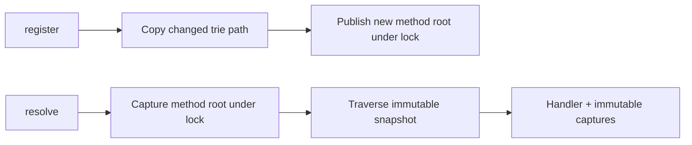
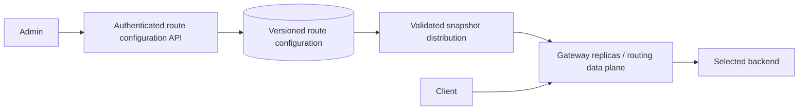

# URL Router — LLD and HLD

## Run and scope

Python 3.11+, no external packages. From this directory:

```powershell
python demo.py
python -m unittest discover -v
```

`router.py` implements a concurrent path-to-handler registry. It returns a handler
and captured parameters; it does not open a server or execute middleware/handlers.
The caller can invoke `match.handler(**match.parameters)` after resolution. This
separation avoids arbitrary application work while the routing lock is held.

## Clarifications and requirements

Ask: supported methods; one-segment versus multi-segment wildcard; named captures;
precedence; trailing slash; duplicate registration; URL decoding; route mutation
frequency; and whether handlers execute within this component.

Implemented contract:

- `register(pattern, handler, method="GET")` publishes one complete route atomically.
- `resolve(path, method="GET")` returns an immutable `RouteMatch` or `None`.
- Literal segments, named `:parameters`, and `*` matching exactly one nonempty segment.
- Precedence is lexicographic by segment specificity: literal, then parameter, then
  wildcard, considering only complete matches. It is not total literal-count scoring.
- Method names contain ASCII letters and are normalized to uppercase. Each method
  has a separate root. No implicit HEAD/GET fallback or automatic OPTIONS behavior.
- `/a/` and `/a` are equivalent; `/` is valid. Empty interior segments, dot segments,
  backslashes, query/fragment text, and ASCII control characters are rejected.
- Maximum 8,192 path characters and 128 segments. Named parameters must be unique
  within one pattern and use ASCII identifiers. `**` and partial wildcards are rejected.
- Duplicate canonical registrations fail. A shared parameter edge must use the
  same name across routes: `/a/:id/x` and `/a/:other/y` conflict intentionally.
- Paths are case-sensitive and treated literally; this module does not decode
  percent escapes, parse hostnames, or normalize Unicode.

Nonfunctional requirements: deterministic matching, atomic publication, no mutable
result dictionaries, no partially installed routes on conflict, bounded recursion
depth, and meaningful tests. Registrations are trusted configuration; total route
count is not capped, so public administrative APIs need quotas. There is no storage
durability or multi-process synchronization in the reference implementation.

## LLD alternatives and selected structure

An exact-path hash map is simplest for exact lookup, but cannot directly express
wildcard segments. A list of patterns is easy to implement and often sufficient for
small registries, at O(number of routes × path length) matching cost. A compiled
regular-expression list is flexible but complicates precedence and worst-case cost.

The selected segment trie shares prefixes. Nodes contain a literal-child map, one
parameter edge/name, one wildcard edge, and optional terminal handler/pattern.
The root dictionary is keyed by HTTP method. Frozen nodes contain read-only child
maps. Registration builds a new path using copy-on-write and atomically publishes
the new root while holding a lock.



## Correct matching and backtracking

Suppose registered patterns are `/a/b/z` and `/a/*/c`. The request `/a/b/c` first
tries the literal `b` branch, fails later, then must try the wildcard branch.
Choosing the literal edge greedily without backtracking incorrectly returns no match.

`visit` tries literal, parameter, wildcard in that order. It returns only at a
terminal node after consuming all segments. Parameter capture is added before
descending and removed on return; successful matches copy the parameter dictionary
into a read-only mapping. Failed branches cannot leak captures into alternatives.
Parameter names cannot repeat within a route, which keeps capture restoration simple.

Core invariants: a published root never changes; each edge category has one defined
meaning; only complete routes have handlers; and capture contents correspond only
to the selected complete path. Duplicate or inconsistent registration raises before
publication, leaving existing readers/writers with a valid root.

## Concurrency and complexity

Registration serializes under one lock. Resolution captures the root under that
lock, then traverses without retaining it. A reader that started before a new route
was published can finish on the old version; a later reader sees the new one.
Handlers may contain their own mutable state; making a `RouteMatch` immutable does
not make arbitrary handler code thread-safe.

Let L be segment count, V the trie nodes visited, d_i literal fanout at copied node
i, and R all stored nodes. Parsing is O(path characters). Matching is O(V + L) with
O(L) stack/capture memory, ignoring bounded string hashing. Exact-only lookup is
expected O(L). With branching it can approach the size of the reachable trie;
do not claim unconditional O(L) or hide the possible branching factor up to three.

Registration costs O(L + sum(d_i)) because each modified literal-child dictionary
is copied. New nodes along the changed path share unchanged subtrees. Live memory
is O(R), plus old paths retained by active readers and temporary copy work. Very
large fanout makes frequent registration expensive. A full rebuilt immutable trie
published in batches may be better for configuration-heavy deployments.

The code uses bounded recursion rather than an iterative stack for readability.
Production registries should enforce route-count and work budgets as well as depth,
particularly if route definitions are untrusted.

## HLD: routing data plane and configuration control plane

Proposed architecture; no network proxy is implemented here:



Use administrative APIs to create validated route configurations and publish
versions, e.g. `PUT /v1/route-configs/{id}` with an expected version. Store stable
handler/service references, not serialized Python functions. Gateways resolve those
references through a known registry and build a full validated snapshot before swap.

Concurrent administrators need compare-and-swap or transactions. Distribution
typically converges asynchronously, so two replicas may briefly use different
versions. If globally atomic activation is required, coordinate activation epochs
and availability trade-offs explicitly. Expose the active config version in logs.
Keep last-known-good configuration if validation or control-plane connectivity fails.

Scale request handling horizontally because each replica keeps a local read-only
trie. Avoid a remote database lookup on every request. Partitioning configuration
by hostname/tenant can reduce memory footprint; apply identity boundaries before
selecting a tenant registry. Route matching and upstream load balancing are separate
responsibilities. Backend pools need health checks, deadlines and circuit breakers.

## Failure handling, security, and observability

- Agree on one canonicalization policy at the gateway: repeated decoding or encoded
  slash disagreements between proxy and application can create authorization bypasses.
  Raw-path treatment here is a library contract, not a secure HTTP parser.
- Authenticate administrators, validate allowed destinations, and prevent arbitrary
  upstream URLs from becoming an SSRF path. Data-plane authorization still applies.
- Bound request/path sizes, route count, matcher work, and upstream response time.
- Distinguish invalid path, no route, method not supported, and upstream failure.
  `None` here does not distinguish 404 from 405; an HTTP adapter must decide that.
- Track lookup latency, no-match rate, handler failures, registration errors, config
  age/version and upstream health. Avoid raw paths as high-cardinality metric labels.
- Canary configuration changes, support rollback, and test compatibility before publish.

## Tests and evolution

Tests cover root, method separation, trailing slash, exact precedence, wildcard
arity, named captures, literal dead-end fallback, capture cleanup, registration
conflicts, bad paths, maximum depth, immutable results, no implicit handler execution,
concurrent writers/readers, and exactly one winner on duplicate registration.

Follow-ups: route removal via another immutable-path update; versioned bulk install;
middleware chains executed outside the registry; optional segments; and `**`.
Multi-segment wildcards substantially change ambiguity and search complexity: specify
greedy/non-greedy semantics and work limits before coding. If blocked, trace two
overlapping routes and a single request rather than adding ad hoc precedence rules.
