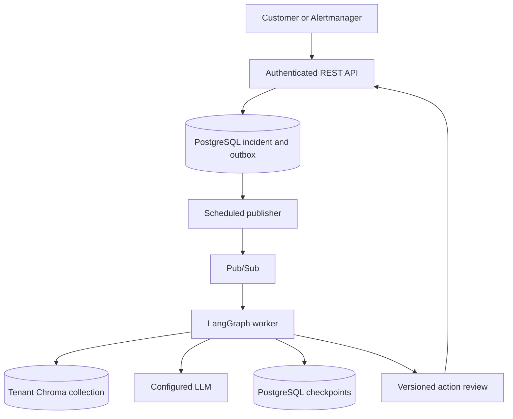

# ObserveAgent — incident investigation, RAG and durable customer context

ObserveAgent lives at `practice/ObserveAgent`, beside the API telemetry lab. It collects incident
evidence, retrieves reviewed operational knowledge from Chroma, produces structured diagnoses,
pauses for action approval, and learns from verified resolutions.

## Choose the execution profile

| Profile | Entry point | Storage | Authentication | Invocation |
|---|---|---|---|---|
| Local teaching lab | `python -m observe_agent.api` | SQLite + embedded Chroma | None; keep localhost-only | Synchronous report/approval response |
| Cloud/asynchronous | `python -m observe_agent.cloud.api` | PostgreSQL + remote Chroma | Hashed customer keys and roles | 202 + durable outbox + worker |
| Cloud worker | Same cloud entry point with APP_ROLE=worker | Shared stores | Google OIDC + Cloud Run IAM | Pub/Sub event and Scheduler relay |
| Spark subworkflow | `build_spark_graph()` Python API | Supplied checkpointer | Operator integration | Reviewed catalog/configuration patch |

The cloud profile is the new multi-tenant implementation. It does not use local files for
customer execution state and does not automatically convert the legacy SQLite database.

## Start with a local cloud-architecture exercise

Prerequisites: Python 3.11+, Docker and Compose. From this directory:

```powershell
python scripts/bootstrap_cloud.py
docker compose --env-file .env.cloud -f compose.cloud.yml up -d --build
```

Open http://localhost:8091/docs. The bootstrap script creates ignored local credentials; Swagger
requests need the key from local-api-key.txt. Follow
[the PowerShell walkthrough](docs/LOCAL_CLOUD_EXERCISE.md) to submit an incident, process its event,
add evidence and inspect the preserved session history.

Locally, `python -m observe_agent.cloud.admin drain` inside the API container processes queued
events instead of Pub/Sub. On Google Cloud, the private worker handles push deliveries. No hidden
background task continues after the API returns 202.

For the original API/telemetry stack, the existing `../API/docker-compose.yml` still runs the
synchronous learning profile on port 8090. Do not expose that unauthenticated profile to customers.

## End-to-end cloud flow



1. Authenticate the key and derive tenant, subject and role from server configuration.
2. Save the incident and outbox event atomically; return 202 and opaque session/run IDs.
3. Publish a stable event ID. Worker loads authoritative context from PostgreSQL.
4. Lock that tenant/incident, extract Prometheus features, retrieve tenant-approved knowledge,
   and run the configured reasoner.
5. Save the report and graph state. Proposed actions pause for a specific versioned approval.
6. New evidence stays in the same session but starts a new investigation revision; old approvals
   cannot authorize the revised proposal.
7. Approved tools execute under tenant allowlists. Reviewed resolutions feed Chroma for future cases.

The main graph has deterministic action planning and one diagnostic reflection pass. An LLM does
not freely choose unrestricted tools. The Spark example can prepare a flat JSON memory change and
draft PR, but it is a separate operator integration and is not automatically routed by the cloud API.

## Models and RAG

| Setting | Purpose |
|---|---|
| EMBEDDING_PROVIDER | hash for offline testing, openai for semantic model calls |
| EMBEDDING_MODEL / EMBEDDING_API_KEY | Embedding model and credential |
| EMBEDDING_BASE_URL / EMBEDDING_DIMENSIONS | Compatible endpoint and vector dimensions |
| LLM_PROVIDER | rule for offline baseline, openai for structured diagnosis |
| LLM_MODEL / LLM_API_KEY | Reasoning model and credential |
| LLM_BASE_URL / LLM_MAX_OUTPUT_TOKENS | Responses-compatible endpoint and per-call output limit |
| ACTION_MODE | dry_run by default; execute after configuring permissions |

Chroma stores document chunks and embeddings. PostgreSQL archives source versions and retains
incident/message/action state. Changing embedding models requires explicit tenant reindexing:
`python -m observe_agent.cloud.admin reindex --tenant acme`.
The LLM adapter requires Responses structured-output support; a chat-completions-only endpoint is
not compatible merely because it accepts an OpenAI-style URL.

Prometheus stores metrics. Traces remain in Jaeger and application logs on stdout in the API lab.
The current collector queries metrics and configured diagnostic APIs; it does not automatically
ingest arbitrary Spark logs or discover all customer repositories.

## Customer context and permissions

- Each incident is keyed by tenant + incident ID.
- Each incident conversation has a stable session UUID; each revision has a different run UUID.
- Checkpoints use server-generated run IDs, never an untrusted supplied thread ID.
- Recent evidence messages and the previous summary become model context; full history stays in SQL.
- Knowledge collections are separate per tenant and embedding profile, with active-document fencing.
- Read, submit and review roles are enforced. Within a tenant, roles apply to all its incidents.
- Pub/Sub and Scheduler use separate verified Google service identities.
- External effects have reservations; uncertain results require reconciliation rather than blind replay.

These controls are covered by tests. Federated end-user login, private per-user sessions within a
tenant, automatic retention/deletion, spend quotas and agent-specific dashboards remain extensions.

## Documentation map

| Read | What you learn |
|---|---|
| [Cloud runtime](docs/CLOUD_RUNTIME.md) | Invocation, REST contracts, async context, concurrency and recovery |
| [Local exercise](docs/LOCAL_CLOUD_EXERCISE.md) | Complete PowerShell submission/message/approval example |
| [Google Cloud deployment](docs/GOOGLE_CLOUD.md) | Cloud Run, Cloud SQL, remote Chroma, secrets, IAM and Pub/Sub |
| [Every module explained](docs/MODULE_GUIDE.md) | Module purpose, code example and failure boundary |
| [Shared configuration](docs/CONFIGURATION.md) | Embeddings, LLMs, RAG and original graph settings |
| [Spark workflow](docs/SPARK_WORKFLOW.md) | Catalog lookup, runtime evidence and reviewed JSON patch |
| [Project knowledge](PROJECT_KNOWLEDGE.md) | Architecture invariants for maintainers and AI assistants |
| [Legacy architecture](docs/ARCHITECTURE.md) / [debugging](docs/DEBUGGING.md) | Original synchronous teaching path |

## Validation

```powershell
python -m pip install -e ".[cloud,dev]"
ruff check .
pytest
```

CI supplies TEST_POSTGRES_URL to test real advisory locks and durable checkpoint restoration.
Without that variable, the PostgreSQL integration test skips; SQLite tests do not prove distributed
locking. The Google Cloud deployment script needs your project resources and credentials and is
not executed by unit tests. Live model, SMTP, GitHub remediation and cloud deployment checks must
be reported separately from offline tests.
