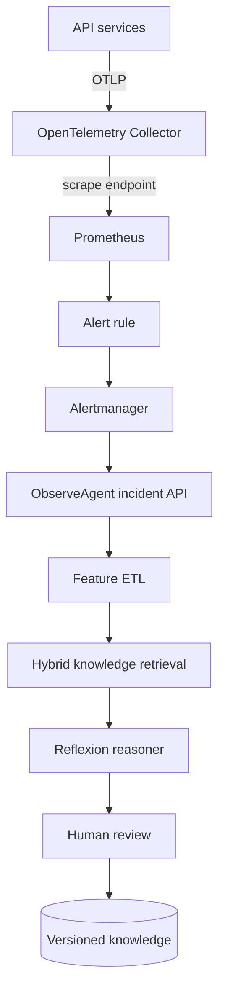

Read [CONFIGURATION.md](CONFIGURATION.md) for runnable commands and the current graph.

# ObserveAgent architecture — step-by-step

## 1. End-to-end mental model

The monitoring path and reasoning path are deliberately separate. Prometheus decides that a
threshold is firing. ObserveAgent investigates after that durable incident boundary.

## 2. Incident creation

`POST /v1/alerts` accepts the Alertmanager webhook shape. Every firing alert becomes a stable
incident ID derived from its service, labels, and start time. `POST /v1/incidents` accepts an
explicit incident for local exercises or another incident-management system.

Lab behavior is synchronous: the request returns the report. Production behavior should persist
the incident and publish an ID to Kafka/SQS/Pub/Sub. A worker then retries each state-machine step.

## 3. Feature extraction / ETL

`IncidentFeatureExtractor` builds three PromQL expressions from the validated service name:

- request rate over five minutes;
- 5xx ratio over five minutes;
- p95 latency from histogram buckets.

For each expression it reads the value at incident start and a configurable earlier baseline. It
stores the current value, baseline, delta, and exact query. It never copies raw Prometheus series
into the vector store. A failed query becomes `missing_sources` and lowers confidence instead of
crashing the whole incident.

Production extension: add range-query statistics, seasonal baselines, Kubernetes saturation,
deployment changes, trace critical-path features, log-template counts, and data-freshness scores.
Keep each adapter read-only and independently timeout-bounded.

## 4. Chunking, embedding, and vector storage

`MarkdownChunker` starts a semantic section at each Markdown heading and splits oversized sections
on paragraph boundaries. Each chunk keeps section and part metadata.

`HashEmbedding` is deterministic feature hashing. It makes the lab offline and repeatable but does
not understand meaning like a production embedding model. Replace it through `EmbeddingProvider`.

`ChromaKnowledgeStore` is the serving vector store. It queries a persistent Chroma collection by
cosine distance, filtering tenant scope, service and approved status. SQLite archives source versions
and active IDs to prevent obsolete chunks returning after partial index updates. The older SQLite
hybrid search remains an offline test adapter. Use `reindex` after embedding profile changes.

## 5. Sources and knowledge authority

The initial source is an approved global commerce latency runbook. Later sources can include
service runbooks, alert definitions, architecture documents, reviewed postmortems, and incident
resolutions. Metadata carries source type, tenant scope, service, owner, reviewer, and status.

Current reviewed runbooks should outrank historical incidents. Stale documents need review and
expiry workflows. Access control is a storage/retrieval responsibility, not a prompt instruction.

## 6. Reflexion workflow

`ReflexionAgent.handle_incident` executes:

1. Persist the incident.
2. Extract the feature vector.
3. Build a retrieval query from symptom, service, route, annotations, values, and deltas.
4. Retrieve approved tenant/service-compatible chunks.
5. Ask the reasoner for facts, at most three hypotheses, verifications, actions, unknowns, and citations.
6. Persist the report for audit and later feedback.
7. Plan configured tools, pause via LangGraph interrupt for review, execute selected allowed tools,
   and re-run diagnosis once when a diagnostic response supplies additional evidence.

The included `RuleBasedReasoner` is intentionally transparent. A model-backed reasoner should use
strict structured output and read-only tools, cite chunk IDs, distinguish fact from hypothesis,
abstain when evidence is insufficient, and never receive unrestricted production credentials.

## 7. Human feedback and self-improvement

`apply_feedback` always records reviewer feedback. It updates retrievable knowledge only when:

- decision is `accept` or `edit`;
- the incident is resolved;
- confirmed root cause is present;
- resolution is present.

The resulting document is split into symptoms, confirmed root cause, resolution, and verification.
It is tenant- and service-scoped and saved as a new versioned source. Future related incidents can
retrieve it. This is safe knowledge improvement, not uncontrolled online model training.

Offline model improvement should use reviewed feedback to build a golden evaluation dataset. Tune
retrieval first; later train a hypothesis ranker or fine-tune a model only after data curation,
temporal train/test splitting, shadow evaluation, canary deployment, and rollback support.

## 8. Security and production trade-offs

- The local API binds only to localhost in Compose but has no authentication. Production requires
  workload identity, reviewer authorization, and per-tool tenant policy.
- SQLite is a teaching store. Production requires durable replicated storage and transactional
  coordination for incident state.
- The webhook is synchronous. Production needs a durable queue, idempotent workers, leases, and DLQ.
- Hash embeddings are local and explainable but weak semantically. Production embeddings add cost,
  latency, privacy, versioning, and reindexing concerns.
- Configured API, email and PR tools are implemented with dry-run defaults and human approval.
  The Spark subworkflow prepares a bounded JSON memory change and draft PR; see
  [SPARK_WORKFLOW.md](SPARK_WORKFLOW.md). Automatic deployment and recovery verification are absent.
