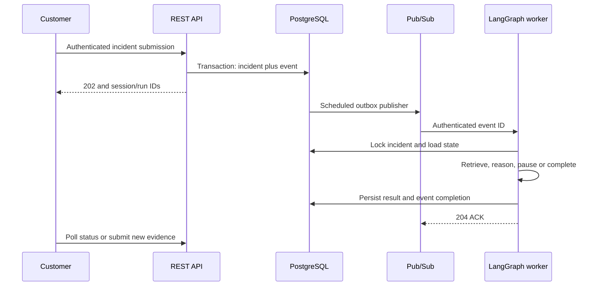

# Asynchronous invocation, tenant context and memory

## The request path

The diagram's database-to-queue arrow is performed by OutboxPublisher, not a database trigger.
Cloud Scheduler invokes the private relay endpoint once a minute. The API never starts background
threads after returning HTTP. The worker completes a bounded graph attempt inside its request.

## Identity and memory layout

| Identifier | Source | Lifetime | Example |
|---|---|---|---|
| tenant_id | Verified credential registry | Customer membership | acme |
| subject | Verified credential registry | User/service identity | alice |
| incident ID | Validated customer request | Incident | inc-1 |
| session_id | Server UUID | Incident conversation | opaque UUID |
| run_id | Server UUID | Investigation revision | opaque UUID |
| event ID | Server UUID | Durable operation | opaque UUID |
| proposal_version | Server hash of revision/actions | Specific reviewable proposal | digest |

There is one session per incident in this reference implementation. Different members of the same
tenant with a read role can inspect it. There are no per-user private sessions within a tenant yet.

Current graph position belongs in PostgreSQL checkpoints; full human input belongs in message
rows; reviewed historical resolutions belong in Chroma and the source archive. A new process loads
these stores; it does not rely on a global Python conversation variable or sticky load balancing.

## A complete worked sequence

1. Acme POSTs incident `inc-1`. SQL atomically writes session S1, run R1 and event E1. Response is 202.
2. Publisher sends only E1. Worker looks up E1's tenant/incident/run in SQL, never from message claims.
3. Worker locks Acme/inc-1, collects features, retrieves Acme knowledge and executes the graph.
4. A proposal pauses R1. Worker commits status `awaiting_approval`, proposal digest V1 and E1=done.
5. Acme sends message M1: "Memory was reduced yesterday." The API saves M1 and creates R2/E2.
   V1 is invalidated; a later approval of V1 returns 409. Session S1 remains unchanged.
6. Worker loads the last 20 evidence messages (bounded to 24,000 context characters) and prior
   summary, then starts R2. Older messages remain in SQL and are accessible through the history API.
7. R2 proposes actions with digest V2. A review-role principal approves specific IDs and V2.
   The API records the authenticated subject; caller-supplied reviewer fields are invalid.
8. The approval event resumes R2's interrupt. Dry-run validates only; execute mode uses tenant
   allowlists and durable action reservations before external calls.
9. A verified resolution is submitted as feedback. A worker indexes approved, resolved feedback
   into Acme's collection. This updates retrieval knowledge, not model weights.

Globex may use the same incident ID. Its SQL keys, session/run UUIDs and vector collection are
different. Supplying Acme's opaque run ID never bypasses the tenant lookup in the API.

## REST contracts

| Endpoint | Role | Success | Meaning |
|---|---|---|---|
| POST /v1/incidents | submit | 202 | Require Idempotency-Key; save and queue |
| POST /v1/alerts | submit | 202 | Alertmanager firing alerts become queued incidents |
| GET /v1/incidents/{id} | read | 200 | Current status, revision, result, proposal version |
| GET /v1/incidents/{id}/report | read | 200 | Latest report; 409 before one exists |
| GET /v1/incidents/{id}/messages | read | 200 | Stored messages/decisions/feedback with authors |
| POST /v1/incidents/{id}/messages | submit | 202 | New evidence and investigation revision |
| POST /v1/incidents/{id}/actions/decision | review | 202 | Version-bound approval event |
| POST /v1/incidents/{id}/feedback | review | 202 | Reviewed knowledge update event |

401 means missing/invalid credentials; 403 means insufficient role or service ownership; another
tenant's resource yields 404. Invalid bodies yield 422. Stale approvals, conflicting idempotency
keys or new input during an active event yield 409. Request bodies are capped at 64 KiB.

## Why two database mechanisms?

Transactions/CAS updates protect API transitions. PostgreSQL advisory locks serialize long graph
execution without keeping the incident row locked for every model call. The worker holds a dedicated
connection for that lock. If it crashes, PostgreSQL releases the connection-scoped lock. Database
and external-provider failures can still create uncertain outcomes; action reservations make those
fail closed rather than claiming universal exactly-once execution.

## Recovery

- Before publication: the unsent outbox row remains eligible.
- After publish, before marking published: the event can be sent twice; stable event ID deduplicates.
- Worker fails after a node checkpoint: redelivery resumes unfinished work with the same run ID.
- Worker fails after graph completion, before event completion: redelivery reads the finished state.
- Worker fails around an external write: reconcile the provider; an existing reservation blocks replay.
- After five failed attempts: event becomes dead and incident failed. Inspect the event error class
  and checkpoints. A new evidence message can start a fresh, reviewable revision.
- Queue delivery is lost/delayed: the relay republishes unfinished events after five minutes.

Full messages and checkpoints require retention planning. No automatic deletion job is enabled.
Model requests contain bounded recent messages, selected knowledge chunks and the previous summary;
this is explicit context selection, not unlimited memory.
