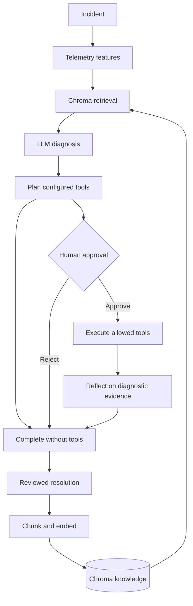

# Models, RAG, workflow and debugging

ObserveAgent lives at `practice/ObserveAgent`, alongside `practice/API`.
It is independently installable. From ObserveAgent run `python -m pip install -e ".[dev]"`.

## Where each capability lives

| Capability | Code | What executes |
|---|---|---|
| Embedding model | `knowledge.py:OpenAIEmbedding` | Calls the configured embedding endpoint for chunks and queries |
| Offline embeddings | `knowledge.py:HashEmbedding` | Deterministic hashing for a no-token demo; no semantic language understanding |
| Vector database | `vector_store.py:ChromaKnowledgeStore` | Persistent Chroma collection, cosine query and tenant/service/review filters |
| RAG | `agent.py:_retrieve_knowledge` and `_diagnose` | Retrieves chunks and sends them with telemetry to the reasoner |
| LLM | `reasoner.py:OpenAIReasoner` | Structured Responses API output with hypotheses and citations |
| LangGraph | `agent.py:_build_graph` | Actual StateGraph nodes, branching, interrupt and resume |
| Tools | `actions.py` | Diagnostic HTTPS GET, SMTP email, PR for an existing branch |
| Reflection | `agent.py:_reflect` | Re-runs diagnosis with successful diagnostic responses |
| Learning | `agent.py:apply_feedback` | Indexes human-confirmed resolutions for later incidents |

## Flow



The action planner is deterministic and uses `incident.action_context`; the LLM does not freely
select arbitrary tools. This is a bounded agent workflow, with one diagnostic reflection pass.
It does not autonomously author patches. The PR adapter requires an existing prepared branch.
No model weights are trained by feedback: improved retrieval provides knowledge to later runs.

## Enable real embeddings and LLM (PowerShell)

```powershell
cd practice/ObserveAgent
python -m pip install -e ".[dev]"
$env:EMBEDDING_PROVIDER = "openai"
$env:EMBEDDING_MODEL = "text-embedding-3-small"
$env:EMBEDDING_API_KEY = "your-secret"
$env:LLM_PROVIDER = "openai"
$env:LLM_MODEL = "gpt-5-mini"
$env:LLM_API_KEY = "your-secret"
$env:LLM_MAX_OUTPUT_TOKENS = "1600"
python -m observe_agent reindex
python -m observe_agent.api
```

Choose any model your provider supports. `EMBEDDING_BASE_URL` and `LLM_BASE_URL` select compatible
providers: the first must implement embeddings, the second the Responses structured-output API.
Chat-completions-only servers are not compatible with this LLM adapter. Temperature is omitted by
default because some models do not support it; set `LLM_TEMPERATURE` only when supported.
Keys stay in environment variables. `.env.example` is a template, not automatically loaded.

Embedding profiles select separate Chroma collections. After changing model, dimensions or URL,
run `reindex`; this costs embedding calls for active documents. SQLite retains source versions and
incident audits; Chroma is the serving vector index. Reindex also repairs a partial index write.
The Chroma directory is `OBSERVE_DB_PATH + .chroma`; graph checkpoints use `.checkpoints`.
Application startup uses persistent SQLite LangGraph checkpoints; unit tests use memory checkpoints.

## Approve a tool

Set `ACTION_ALLOWLIST=http_get`, `HTTP_ALLOWED_HOSTS=status.example.com` and supply incident
`action_context={"diagnostic_url":"https://status.example.com/health"}`. A sufficiently confident
diagnosis returns `status=awaiting_approval` and the exact proposal. Submit
`{"approved":true,"reviewer":"operator","action_ids":[]}` to
`POST /v1/incidents/{id}/actions/decision`. Empty IDs selects all proposed actions.
`ACTION_MODE=dry_run` validates without sending. Set `execute` for actual calls.

PR context: `github_repository`, `github_head`, optional `github_base`, `github_title`, `github_body`.
Enable `github_pull_request`, `GITHUB_ALLOWED_REPOSITORIES` and `GITHUB_TOKEN`.
Email context: `notify_email`, optional `email_subject`, `email_body`. Enable `email`,
`EMAIL_ALLOWED_RECIPIENTS`, `SMTP_HOST`, `SMTP_PORT`, `SMTP_FROM`, `SMTP_USERNAME`, `SMTP_PASSWORD`.

## Debug boundaries and production limits

1. Missing features: verify Prometheus URL, query and incident timestamps.
2. Empty retrieval: check tenant/service/review metadata, embedding profile and run reindex.
3. LLM failures: check endpoint compatibility, model access and output-token budget.
4. No action: check confidence threshold, context targets and ACTION_ALLOWLIST.
5. Pending graph: submit the approval decision on the same incident ID.
6. Failed tool: inspect the action result and target allowlists.
7. No learned knowledge: feedback needs accept/edit, resolved=true, cause and resolution.

Run one API worker for this local lab. Reviewer identity is caller-supplied; add authentication and
tenant authorization before shared deployment. Allowlisted HTTPS needs an egress proxy/firewall
to protect against DNS rebinding. Recorded action results avoid ordinary replay, but a crash between
an external side effect and recording its result can duplicate a PR/email: production requires
provider reconciliation/idempotency. A completed tool does not prove SLO recovery.

References: [Chroma queries](https://docs.trychroma.com/docs/querying-collections/query-and-get),
[LangGraph interrupts](https://docs.langchain.com/oss/python/langgraph/interrupts).
